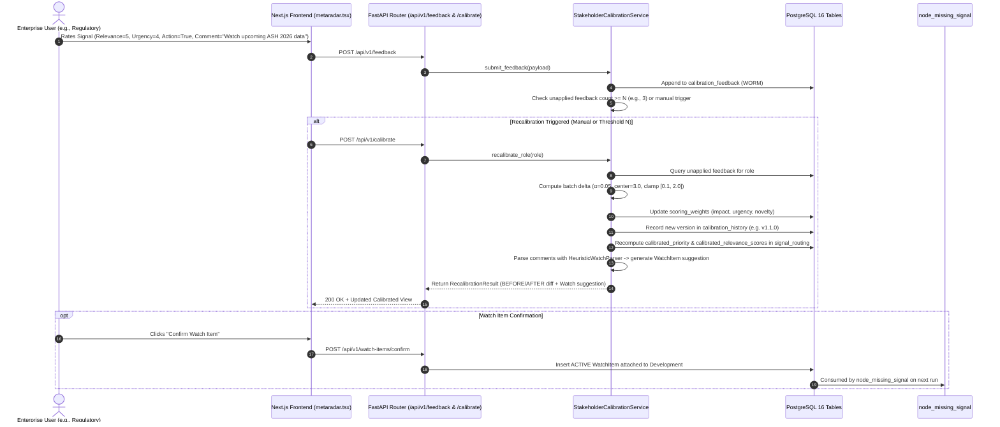

# Phase 5: Calibration & End-to-End Verification — Research

**Phase:** `05-calibration-and-end-to-end-verification`  
**Status:** Complete  
**Date:** 2026-08-18  
**Domain:** Human-in-the-Loop Stakeholder Calibration, Versioned Scoring Weight Updates, Heuristic Watch-Rule Parser, Hemgenix 3-Year Durability Demo Scenario, and End-to-End Definition of Done Audit.

---

## 1. Executive Summary

Phase 5 delivers the human-in-the-loop (HITL) calibration and end-to-end verification milestones for MetaRadar v5.1. It closes the feedback loop between enterprise stakeholders and the decision-intelligence pipeline.

The phase encompasses three primary deliverables:
1. **`StakeholderCalibrationService` & Calibration API (`REQ-P5-1`)**: Persistent WORM feedback logging (`calibration_feedback`), versioned per-factor batch weight updates (`scoring_weights`, `calibration_history`), side-by-side baseline vs calibrated routing recalculations (`signal_routing`), and a deterministic keyword-based watch-rule parser generating structured `WatchItem` suggestions.
2. **Curated Demo Dataset & Scripted E2E Scenario (`REQ-P5-2`)**: The flagship "Hemgenix 3-Year Durability Shift" competitive intelligence storyline across PubMed publications, CSL Behring press releases, and congress abstracts, validated by an automated end-to-end integration test (`tests/test_e2e_calibration_scenario.py`) and rendered with an interactive `StakeholderFeedbackWidget` with a visible BEFORE → FEEDBACK → AFTER comparison.
3. **Definition of Done & Quality Audit (`REQ-P5-3`)**: Execution of all strict quality gates (TypeScript, ESLint, Next.js build, Pytest suite, OpenAPI contract drift, and release documentation).

---

## 2. Standard Stack & System Components

| Component | Standard / Technology | Purpose in Phase 5 |
| :--- | :--- | :--- |
| **Backend Service** | Python 3.11+, SQLAlchemy 2.0 (Async), Pydantic v2 | `StakeholderCalibrationService` in `backend/app/services/calibration.py` |
| **Persistence** | PostgreSQL 16 + pgvector | `calibration_feedback`, `scoring_weights`, `signal_routing`, `calibration_history`, `watch_items` |
| **Contract Synchronization** | `scripts/export_openapi.py` | Exports OpenAPI schema and syncs `frontend/types/api.ts` (0 schema drift) |
| **Frontend Framework** | Next.js 16.3.0 (App Router), React 19, Lucide Icons | `StakeholderFeedbackWidget` and BEFORE/AFTER diff view in `frontend/components/metaradar.tsx` |
| **Testing** | Pytest, `pytest-asyncio`, Next.js test runner | Scripted scenario test `tests/test_e2e_calibration_scenario.py` |

---

## 3. Architecture Patterns & Flow

### 3.1 Persistent Batch Calibration Architecture



---

## 4. Don't Hand-Roll

1. **Do NOT Hand-Roll Complex Neural Weight Learners**: Use the deterministic bounded gradient update math:
   $$\Delta w = \alpha \cdot (\overline{R} - 3.0)$$
   where $\alpha = 0.05$, clamped to $[0.1, 2.0]$. It provides explainable, reproducible, and verifiable BEFORE/AFTER deltas.
2. **Do NOT Use External LLMs for Watch Rule Extraction**: Use deterministic regex/keyword heuristic parsing (`"watch"`, `"congress"`, `"upcoming"`, `"trial"`, `"phase"`, `"publication"`). This ensures zero external API cost, zero privacy gate latency, and predictable unit test validation.
3. **Do NOT Overwrite Baseline Data**: Baseline routing (`baseline_primary_function`, `baseline_relevance_scores`, `baseline_suggested_action`) must remain permanent in `signal_routing` (WORM). Calibrated data resides in separate `calibrated_*` columns.
4. **Do NOT Create Redundant DB Migrations**: `ScoringWeights`, `CalibrationFeedback`, `SignalRouting`, `CalibrationHistory`, and `WatchItem` models already exist in `backend/app/models/__init__.py`.

---

## 5. Common Pitfalls & Guardrails

| Pitfall | Risk | Mitigation |
| :--- | :--- | :--- |
| **Unbounded Weight Drift** | Continuous high/low ratings push weights to extreme values (e.g., $10.0$ or $0.0$). | Strict clamping to $[0.1, 2.0]$ on all weights (`impact_weight`, `urgency_weight`, `novelty_weight`). |
| **In-Flight Frontend Race Conditions** | Rapid feedback submissions interleave state updates. | Optimistic UI feedback with disabled submit button during in-flight network requests and automatic cache refetch. |
| **Contract Schema Drift** | Adding endpoints without updating TypeScript interfaces breaks CI gate. | Run `python scripts/export_openapi.py` and verify `pytest tests/test_contract_drift.py`. |
| **Non-Deterministic Watch Rule IDs** | Inconsistent test runs due to random UUIDs in deterministic scenario tests. | Use deterministic seed generation or test-specific assertion fixtures. |
| **Silent Overwrites of Routing Baseline** | Losing initial signal state makes BEFORE/AFTER comparison impossible. | Enforce database non-null constraints on `baseline_*` fields and write exclusively to `calibrated_*` fields during recalibration. |

---

## 6. Data Models & Schema Contracts

### 6.1 Pydantic Request & Response Schemas (`backend/app/schemas/__init__.py`)

```python
class FeedbackSubmissionRequest(BaseModel):
    signal_id: UUID
    stakeholder_function: str = Field(..., description="Canonical function (e.g., REGULATORY, MEDICAL_AFFAIRS)")
    relevance_rating: int = Field(..., ge=1, le=5, description="1 to 5 star rating")
    urgency_rating: int = Field(..., ge=1, le=5, description="1 to 5 urgency rating")
    action_appropriate: bool = Field(..., description="Whether proposed action is appropriate")
    comments: Optional[str] = Field(None, max_length=1000)
    user_id: Optional[str] = Field("demo_user", max_length=100)

class FeedbackSubmissionResponse(BaseModel):
    feedback_id: UUID
    signal_id: UUID
    stakeholder_function: str
    status: str = "recorded"
    unapplied_count: int
    recalibration_triggered: bool

class RoleWeightSchema(BaseModel):
    stakeholder_function: str
    impact_weight: float
    urgency_weight: float
    novelty_weight: float
    updated_at: datetime

class CalibrationWeightsResponse(BaseModel):
    version: str
    weights: List[RoleWeightSchema]

class WatchRuleSuggestionSchema(BaseModel):
    suggestion_id: str
    development_id: Optional[UUID]
    trigger_event: str
    expected_event: str
    monitoring_window_days: int
    responsible_function: str
    rationale: str

class BeforeAfterComparisonSchema(BaseModel):
    signal_id: UUID
    stakeholder_function: str
    baseline_priority: str
    calibrated_priority: str
    baseline_relevance_score: float
    calibrated_relevance_score: float
    baseline_suggested_action: str
    calibrated_suggested_action: str
    confidence_uplift_pct: float

class RecalibrateResponse(BaseModel):
    status: str
    calibration_version: str
    stakeholder_function: str
    applied_feedback_count: int
    updated_weights: RoleWeightSchema
    comparisons: List[BeforeAfterComparisonSchema]
    watch_rule_suggestions: List[WatchRuleSuggestionSchema]

class FeedbackRoleSummarySchema(BaseModel):
    stakeholder_function: str
    total_feedback_count: int
    average_relevance: float
    average_urgency: float
    action_approval_rate: float

class FeedbackSummaryResponse(BaseModel):
    total_feedback: int
    roles: List[FeedbackRoleSummarySchema]

class ConfirmWatchItemRequest(BaseModel):
    development_id: UUID
    trigger_event: str
    expected_event: str
    monitoring_window_days: int = 90
    responsible_function: str
```

---

## 7. Weight Calibration Mathematics & Versioning

### 7.1 Weight Adjustment Formula (Per Factor)

Given a set of $M$ feedback items for stakeholder function $F$:
1. **Mean Ratings**:
   $$\overline{R}_{\text{rel}} = \frac{1}{M}\sum_{i=1}^M r_{\text{rel}, i}, \quad \overline{R}_{\text{urg}} = \frac{1}{M}\sum_{i=1}^M r_{\text{urg}, i}$$
2. **Delta Computation**:
   $$\Delta w_{\text{impact}} = \alpha \cdot (\overline{R}_{\text{rel}} - 3.0)$$
   $$\Delta w_{\text{urgency}} = \alpha \cdot (\overline{R}_{\text{urg}} - 3.0)$$
3. **Weight Clamping**:
   $$w_{\text{impact}}^{(t+1)} = \max\left(0.1, \min\left(2.0, w_{\text{impact}}^{(t)} + \Delta w_{\text{impact}}\right)\right)$$
   $$w_{\text{urgency}}^{(t+1)} = \max\left(0.1, \min\left(2.0, w_{\text{urgency}}^{(t)} + \Delta w_{\text{urgency}}\right)\right)$$

### 7.2 Priority & Relevance Score Recalculation

For a signal $S$ evaluated for function $F$:
$$\text{Calibrated Score}(S, F) = \min\left(1.0, \text{Base Score}(S, F) \cdot w_{\text{impact}}^{(t+1)}\right)$$
$$\text{Priority Score} = w_{\text{impact}} \cdot S_{\text{impact}} + w_{\text{urgency}} \cdot S_{\text{urgency}} + w_{\text{novelty}} \cdot S_{\text{novelty}}$$
- $\text{Priority Score} \ge 0.75 \implies \text{CRITICAL}$
- $0.50 \le \text{Priority Score} < 0.75 \implies \text{HIGH}$
- $0.30 \le \text{Priority Score} < 0.50 \implies \text{MEDIUM}$
- $< 0.30 \implies \text{LOW}$

---

## 8. Keyword Heuristic Watch Rule Parsing

### 8.1 Parser Logic
The `HeuristicWatchParser` scans feedback comments for domain-specific event intents:

```python
KEYWORDS_MAP = {
    "congress": ("ASH/ISTH Congress presentation", 90),
    "trial": ("Clinical trial phase readout", 180),
    "durability": ("Long-term durability follow-up", 180),
    "regulatory": ("Regulatory filing or approval update", 270),
    "safety": ("Safety surveillance signal", 90),
    "competitor": ("Competitor commercial milestone", 120),
}
```

When a user writes:  
> *"Critical 3-year durability data for Hemgenix; watch upcoming ASH 2026 congress abstracts for sustained Factor IX expression."*

The parser extracts:
- **Trigger Event**: `"3-year durability data for Hemgenix"`
- **Expected Event**: `"ASH/ISTH Congress presentation regarding sustained Factor IX expression"`
- **Monitoring Window**: `90 days`
- **Responsible Function**: `REGULATORY` or `MEDICAL_AFFAIRS`
- **Status**: `PROPOSED` (transfers to `ACTIVE` upon human confirmation).

---

## 9. Demo Story Dataset: "The Hemgenix 3-Year Durability Shift"

### 9.1 Three Converging Signals
1. **Signal 1 (Scientific Publication / PubMed)**:
   - *Title*: "3-Year Factor IX Expression and Bleeding Rate Durability Following Etranacogene Dezaparvovec in Severe Haemophilia B"
   - *Source*: PubMed / NEJM
   - *Key Finding*: 54 patients maintain mean FIX activity of 36.7%, but 4 patients exhibit antibody titers leading to secondary FIX decline.
2. **Signal 2 (Competitor Announcement / Press Release)**:
   - *Title*: "CSL Behring Announces Positive 3-Year HOPE-B Long-Term Follow-up for HEMGENIX®"
   - *Source*: CSL Behring Global Press Wire
   - *Key Finding*: Commercial durability messaging claiming lifelong prophylaxis displacement.
3. **Signal 3 (Congress Abstract / Clinical Update)**:
   - *Title*: "Abstract #1042: Comparative Durability and Inhibitor Risks in Non-Factor Prophylaxis vs Single-Dose Gene Therapy"
   - *Source*: ASH 2026 Congress
   - *Key Finding*: Direct benchmarking of concizumab/mim8 vs Hemgenix durability curves.

### 9.2 Complete Scenario Arc
```
[Ingest 3 Signals] ──> [Confluence Detected: Hemgenix 3-Yr Durability]
        │
        ▼
[Lifecycle Tracker: Post-Market Durability Tracking]
        │
        ▼
[Baseline Routing: Regulatory & Medical Affairs (Score: 0.88)]
        │
        ▼
[Stakeholder Feedback: Regulatory rates 5★ + Comments "Watch ASH 2026"]
        │
        ▼
[Recalibrate Triggered] ──> [Weights Updated: Impact 1.0 -> 1.10]
        │
        ▼
[BEFORE/AFTER: Regulatory Score 0.88 -> 0.97, Priority HIGH -> CRITICAL]
        │
        ▼
[Watch Item Suggested & Confirmed: Active 90-Day Congress Window]
```

---

## 10. Frontend UI: `StakeholderFeedbackWidget` & BEFORE/AFTER Readout

### 10.1 UI Component Architecture
Inside `frontend/components/metaradar.tsx` (within the `SignalDrawer`):
1. **Q3 Stakeholder Routing Panel**:
   - Each role badge (Medical Affairs, Regulatory, Safety, etc.) has a small star-rating feedback trigger.
2. **`StakeholderFeedbackWidget`**:
   - 5-Star Relevance Rating & 5-Star Urgency Rating.
   - "Action Appropriate" Toggle (Yes/No).
   - Comment text box (placeholder: *"e.g. Watch upcoming congress publication..."*).
   - "Submit Feedback" button (submits to `POST /api/v1/feedback`).
   - "Recalibrate Now" button (triggers `POST /api/v1/calibrate`).
3. **BEFORE / AFTER Comparison Card**:
   - Side-by-side display of Baseline vs Calibrated values.
   - Green uplift badge: *"Confidence uplift: +9.2% (Regulatory priority: CRITICAL)"*.
   - Parsed Watch Item Card with "Confirm Watch Rule" button.

---

## 11. Code Examples & Target Implementations

### 11.1 Service Interface (`backend/app/services/calibration.py`)

```python
class StakeholderCalibrationService:
    def __init__(self, session: AsyncSession):
        self.session = session

    async def submit_feedback(self, req: FeedbackSubmissionRequest) -> FeedbackSubmissionResponse:
        ...

    async def recalibrate_role(self, stakeholder_function: str) -> RecalibrateResponse:
        ...

    async def get_calibration_weights(self) -> CalibrationWeightsResponse:
        ...

    async def get_feedback_summary(self) -> FeedbackSummaryResponse:
        ...

    async def confirm_watch_item(self, req: ConfirmWatchItemRequest) -> WatchItemResponse:
        ...
```

---

## 12. Quality Gate & DoD Verification Plan

| Gate | Execution Command | Acceptance Threshold |
| :--- | :--- | :--- |
| **TypeScript Strictness** | `node frontend/node_modules/typescript/bin/tsc --project frontend/tsconfig.json --noEmit` | 0 Errors |
| **ESLint Static Analysis** | `npm --prefix frontend run lint` | 0 Errors |
| **Next.js Production Build** | `npm --prefix frontend run build` | 100% Compiled |
| **Contract Synchronization** | `pytest tests/test_contract_drift.py -v` | 0 Schema Drift |
| **End-to-End Scenario Test** | `pytest tests/test_e2e_calibration_scenario.py -v` | 100% Passed |
| **Full Pytest Suite** | `pytest -v` | All Passed (including existing 65 tests) |
