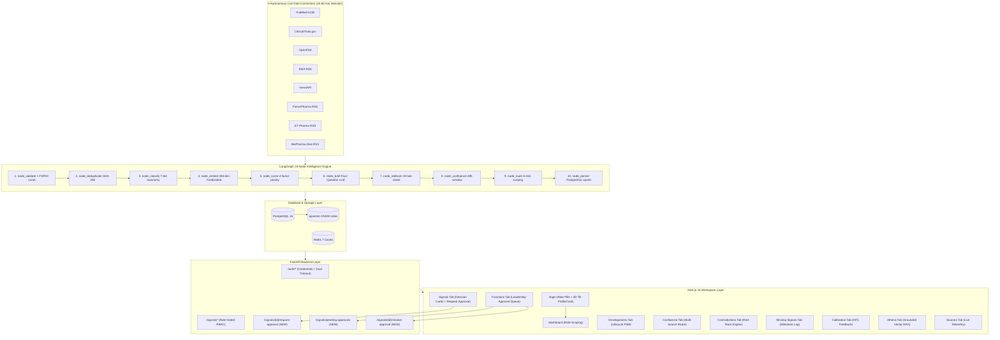
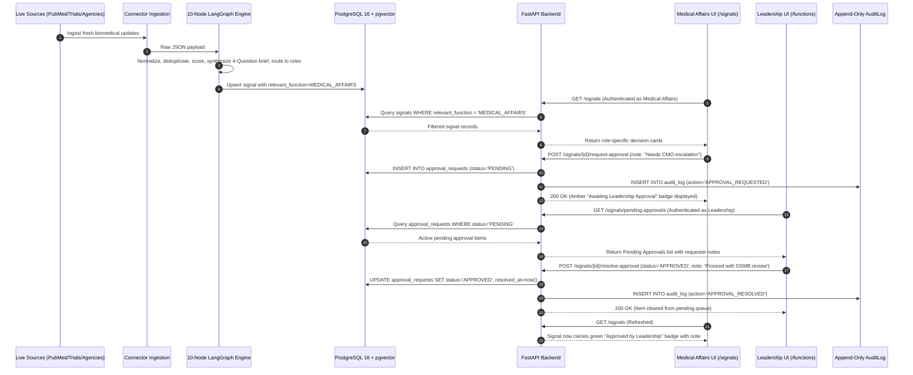

# Phase 12 — Context & Decisions (Hackathon MVP)

## Phase Overview

**Phase Title:** Hackathon MVP — Proper Login System, Cross-Functional Approval Workflow & Documentation
**Phase Number:** 12
**Depends On:** Phase 11 (MetaRadar Productionization — COMPLETED & VERIFIED)
**Target Branch:** `feature/phase-12-hackathon-mvp`
**Date:** 2026-08-30
**Priority Classification:**
- **P0:** Login page + credential-based auth with ProfileCard (replaces persona switcher dropdown) — MINIMAL CHANGE
- **P1:** Cross-functional approval request workflow (`approval_requests` table + 3 endpoints + frontend modal + Leadership panel)
- **P2:** README role responsibility section, `docs/DEMO_SCRIPT.md`, `docs/SYSTEM_ARCHITECTURE.md`, untracked `pitch/PITCH.md`

> **CORE PRINCIPLE — MINIMAL IMPACT:** The entire system functions cleanly and reliably. These changes are surgical, additive, and preserve all existing LangGraph nodes, routing algorithms, database tables, and verification invariants.

---

## 1. System Architecture Diagram

---

## 2. End-to-End Dataflow Diagram

---

## 3. Why MetaRadar vs Generic ChatGPT / Perplexity

| Capability | Generic ChatGPT / Perplexity | MetaRadar Decision Intelligence |
|:---|:---|:---|
| **Operating Model** | **Passive & Reactive:** User must manually formulate search queries. | **Autonomous & Proactive:** Continuous 24/7 background scheduler monitoring 8 live sources. |
| **Trust & Provenance** | **Probabilistic Hallucinations:** Generates unverified citations. | **100% Deterministic Evidence:** Linked to immutable raw Bronze records (`PMID`, `NCT ID`, `FDA ID`). |
| **Role Calibrated Actions** | **Single Generic Output:** Same wall of text for all users. | **6-Role Semantic Decomposition:** Tailored decision briefs (`[FACT]`, `[INTERPRETATION]`, `[SPECULATION]`). |
| **Cross-Source Temporal Synthesis** | **Isolated One-Off Summaries:** No temporal tracking across sources. | **48h Confluence Radar + 19-Rule Red-Team Contradiction Engine.** |
| **Governance & Security** | **Data Leakage & Zero Audit:** Prompts exit enterprise boundary; no audit trail. | **Local GGUF Privacy:** On-prem inference, PII/PHI scrubber, append-only PostgreSQL `audit_log`. |

---

## 4. Operational Importance of Every Workspace Tab

1. **Signals Tab:** Operational action inbox; role-scoped queue with 4-factor priority scoring, source hierarchy tags, 4-question decision cards, and leadership approval escalation.
2. **Developments Tab:** Longitudinal asset lifecycle tracker following competitors across 9 FSM stages (`Preclinical` to `Post-Market`).
3. **Confluence Tab:** Multi-source convergence radar detecting independent validation (≥3 source types within 48h) confirming strategic shifts.
4. **Contradictions Tab:** Red-Team adversarial engine evaluating pairwise clinical contradictions across 19 rules (Rules A through S).
5. **Missing Signals Tab:** Regulatory and clinical milestone sentinel monitoring unfulfilled expectations (delayed filings, overdue readouts).
6. **Functions Tab:** Cross-functional alignment command center, stakeholder telemetry, and the **Leadership Pending Approvals Queue**.
7. **Calibration Tab:** Human-in-the-loop adaptation engine tuning per-function relevance weights based on user feedback.
8. **Athena Intelligence Tab:** Source-grounded vector RAG conversational assistant querying live PostgreSQL/pgvector database with verifiable citations.
9. **Sources Tab:** Operational health telemetry monitoring all 8 connectors (`HEALTHY`, `NO_NEW_DATA`, `DEGRADED`, `CONFIG_ERROR`).

---

## 5. Engineering & Debugging Odyssey (Problems Faced & Solved)

1. **GGUF Main Thread Event Loop Blocking:** Resolved by offloading GGUF CPU/CUDA matrix computations to dedicated thread pools via `asyncio.to_thread`.
2. **Bronze Normalization Silent Drops in `node_validate`:** Heterogeneous connector keys (`abstract`, `description`, `text`) normalized into canonical schema envelopes.
3. **RBAC Routing Column Persistence:** Fixed `runner.py` upsert query to persist `relevant_function` and `route_destination` to PostgreSQL.
4. **403 Forbidden & AbortSignal Parsing:** Corrected client-side `all_functions` parameter handling and ensured clean `AbortSignal` object lifecycle.
5. **Truthful Source Telemetry:** Distinguishing true system degradation from healthy zero-yield polls (`NO_NEW_DATA`).
6. **Subprocess & Port Concurrency Races:** Engineered `start.py` with port clearing and synchronized Docker health checks.

---

## 6. Canonical Role Responsibilities & Demo Credentials

| Role | Email | Password | Primary Responsibility | Scope |
|:-----|:------|:---------|:-----------------------|:------|
| **Medical Affairs** | `medical.affairs@metaradar.demo` | `MedAffairs2026!` | Clinical trial readouts, efficacy, Factor VIII/IX expression | Own Function |
| **Regulatory** | `regulatory@metaradar.demo` | `Regulatory2026!` | FDA/EMA submissions, PDUFA dates, label expansions | Own Function |
| **Safety** | `safety@metaradar.demo` | `Safety2026!` | Adverse events, inhibitor development, liver toxicity | Own Function |
| **Market Access** | `market.access@metaradar.demo` | `Access2026!` | ICER reports, reimbursement dossiers, HTA hurdles | Own Function |
| **Communications** | `comms@metaradar.demo` | `Comms2026!` | Press releases, congress positioning, media narrative | Own Function |
| **Leadership** | `leadership@metaradar.demo` | `Leader2026!` | Cross-functional portfolio risk, executive approvals | All Functions |
| **Administrator** | `admin@metaradar.demo` | `Admin2026!` | Platform governance & connector management | All Functions |

---

## 7. ProfileCard Integration Specification

- **Trigger:** On `/login`, hovering a role pill renders the interactive 3D tilt `ProfileCard` (Dr. Elena Vance, Marcus Chen, Dr. Sarah Jenkins, Henrik Lindqvist, Claire Beaumont, Dr. Alexander Wright).
- **Action:** Clicking a role pill auto-populates the email and password fields for instant, one-click access for hackathon judges.
- **Component & Styles:** `frontend/components/auth/ProfileCard.tsx` and `frontend/components/auth/ProfileCard.css`.

---

## 8. Definition of Done — Phase 12

- [ ] `/login` route active with interactive role pills and 3D tilt `ProfileCard`.
- [ ] Role switcher dropdown in navbar replaced with RoleChip + Logout button.
- [ ] Functional roles can request leadership approval on qualifying signals.
- [ ] Leadership sees pending approval badge and can resolve requests in Functions workspace.
- [ ] All approval events recorded in append-only `audit_log`.
- [ ] `pytest tests/test_login_credentials.py tests/test_approval_workflow.py` 100% pass.
- [ ] Clean TypeScript compile (`npx tsc --noEmit`).
- [ ] Untracked `pitch/PITCH.md` contains complete pitch, debugging history, ChatGPT comparison, and tab breakdown.
