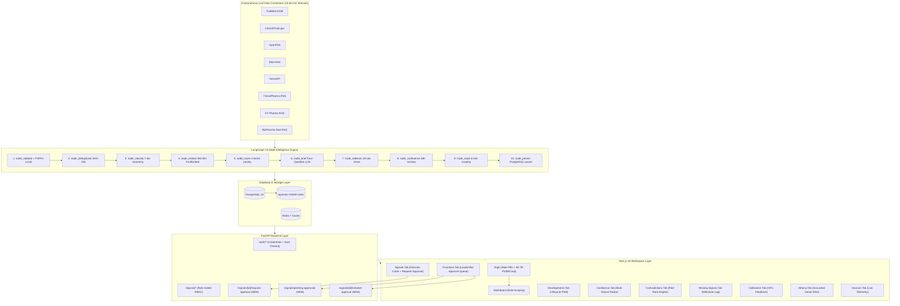
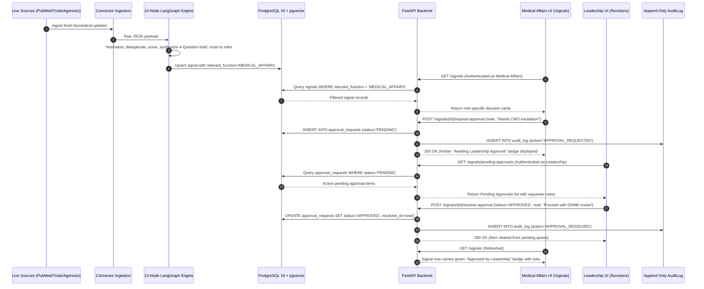

# Phase 12 — Context & Decisions (Hackathon MVP)

## Phase Overview

**Phase Title:** Hackathon MVP — Full NN GBS Kick-Off Alignment, Role-Based Login, Cross-Functional Approval & Governance  
**Phase Number:** 12  
**Depends On:** Phase 11 (MetaRadar Productionization — COMPLETED & VERIFIED)  
**Target Branch:** `feature/phase-12-hackathon-mvp`  
**Date:** 2026-08-30  
**Source Master Authority:** `docs/NN GBS Hackathon 2026 — Kick-off.pptx` (Problem Statement #3: Haemophilia Intelligence Radar)  
**Priority Classification:**
- **P0:** Login page + credential-based auth with ProfileCard (replaces persona switcher dropdown) — MINIMAL CHANGE
- **P1:** Cross-functional approval request workflow (`approval_requests` table + 3 endpoints + frontend modal + Leadership panel)
- **P2:** README role responsibility section, `docs/DEMO_SCRIPT.md`, `docs/SYSTEM_ARCHITECTURE.md`, untracked `pitch/PITCH.md`

> **CORE PRINCIPLE — MINIMAL IMPACT:** The entire system functions cleanly and reliably. These changes are surgical, additive, and preserve all existing LangGraph nodes, routing algorithms, database tables, and verification invariants.

---

## 1. Hackathon Objective & Scope (From Kick-Off Deck)

### A. Core Mandate
Build an **AI-powered Haemophilia Intelligence Radar** that:
- Detects, interprets, and prioritizes external signals continuously from multiple trusted sources.
- Translates raw updates into source-linked, role-calibrated, and actionable insights.
- Answers the **4 Practical Questions**:
  1. **Q1: What changed?** — Detect & summarize the most relevant Haemophilia updates.
  2. **Q2: Why does it matter?** — Assess potential impact on patients, competitors (Roche/Chugai, Pfizer, Sanofi, Sobi), market, and Novo Nordisk.
  3. **Q3: Who should review it?** — Route each signal to the right NN function (`Medical Affairs`, `Regulatory`, `Safety/PV`, `Market Access`, `MedComms`, `Leadership`).
  4. **Q4: What action is needed?** — Suggest specific actions: `Review`, `Monitor`, `Escalate`, `Briefing Update`, or `FAQ Preparation` labeled with `[FACT]`, `[INTERPRETATION]`, `[SPECULATION]`.

### B. In-Scope vs Out-of-Scope Boundaries
- **In-Scope:**
  - Haemophilia A (Factor VIII deficiency) & Haemophilia B (Factor IX deficiency).
  - Modalities: Factor therapies, Non-factor therapies, Bispecifics (e.g. emicizumab, NXT007, Mim8), Gene therapies (Hemgenix, Roctavian), RNAi (fitusiran).
  - Competitors: Roche/Chugai, Pfizer, Sanofi, Sobi, Novo Nordisk.
  - Signal Streams: Clinical trials (phases, readouts, delays), Regulatory (PDUFA, filings, approvals, EPAR), Congresses (ISTH, EAHAD, ASH), Publications, Patient voice/access, Safety/off-label narratives.
  - Scalability: Foundation designed to scale to other therapy areas (Oncology, Diabetes, Obesity).
- **Out-of-Scope (Strictly Enforced):**
  - Confidential Novo Nordisk strategy or internal data (Zero non-public info).
  - Patient-identifiable data (PII/PHI scrubbed at ingestion).
  - External-facing promotional content or clinical causality determinations.

---

## 2. The 8 Required Deliverables Checklist

| # | Deliverable | MetaRadar Implementation & Location |
|:---|:---|:---|
| **1** | 1–2 page concept note & prototype timeline | [`README.md`](file:///c:/Users/OM%20Prakash/Documents/novonordisk/README.md) & [`.planning/ROADMAP.md`](file:///c:/Users/OM%20Prakash/Documents/novonordisk/.planning/ROADMAP.md) |
| **2** | Working or clickable prototype | FastAPI (`http://localhost:8000`) + Next.js 16 (`http://localhost:3000`) |
| **3** | Sample data schema and source list | `contracts/openapi.json`, `types/api.ts`, and Sources workspace (`/sources`) |
| **4** | Dashboard demo with signal cards | Signals workspace with 4-question decision cards & source hierarchy badges |
| **5** | AI baseline vs stakeholder-calibrated example | Calibration workspace (`/calibration`) + 5-step learning model in `pitch/PITCH.md` |
| **6** | Validation metrics & architecture diagram | [`docs/SYSTEM_ARCHITECTURE.md`](file:///c:/Users/OM%20Prakash/Documents/novonordisk/docs/SYSTEM_ARCHITECTURE.md) + 166+ passing test suites |
| **7** | Risk & guardrail summary | PII/PHI scrubber, append-only `AuditLog`, FACT/INTERPRETATION labeling |
| **8** | Final 5–7 slide presentation deck outline | [`pitch/PITCH.md`](file:///c:/Users/OM%20Prakash/Documents/novonordisk/pitch/PITCH.md) (Private & untracked via `.gitignore`) |

---

## 3. The 5 Target Success Metrics

1. **100% Source-Linked Summaries:** Every single signal card traces to immutable raw Bronze payloads with persistent identifiers (`PMID`, `NCT ID`, `FDA Submission ID`, `EMA URL`).
2. **≥ 85% Classification Accuracy:** Validated by deterministic LangGraph 10-node classification tests across 7 signal types.
3. **≤ 5 Min to Identify Top Weekly Signals:** Prioritized dashboard inbox with 4-factor scoring and executive briefing cards.
4. **0 Confidential or Patient Data:** Enforced by pre-processing PII/PHI regex filters and public-only ingestion sources.
5. **Required Stakeholder-Calibrated Improvement:** Per-function relevance weight adaptation via human-in-the-loop thumbs up/down feedback.

---

## 4. Stakeholder Learning Model (AI + Human Calibration)

The kick-off deck defines the **5-Step Calibration Loop**:
```
1. External signals (News, Trials, Congresses, Publications, Regulatory, Access)
      │
      ▼
2. AI Baseline (Initial classification, summary, priority score, suggested action)
      │
      ▼
3. NN Stakeholder Input (Function-specific feedback on relevance, urgency, decision logic)
      │
      ▼
4. Calibrated Logic (Refined scoring rules, routing logic, sharper "so what" explanations)
      │
      ▼
5. Better Intelligence (Source-linked, trusted, actionable signal cards)
```

### Live Calibration Examples (Slide 4 Demonstration)
| Signal Type | AI Baseline Output | Stakeholder-Calibrated Output |
|:---|:---|:---|
| **Competitor Phase III Trial Update** (e.g. NXT007) | *"High competitor relevance"* | *"Route to Medical Affairs + Regulatory; monitor ISTH/ASH congress readouts; avoid unsupported head-to-head comparisons."* |
| **Access / Reimbursement Discussion** | *"Market impact likely"* | *"Route to Market Access/HEOR; assess potential patient-access implications and payer negotiation narratives."* |
| **Safety or Off-Label Narrative** | *"Safety-related discussion"* | *"Flag for Safety/PV review; strictly do not assess medical causality."* |

---

## 5. System Architecture & Dataflow Diagrams

### A. System Architecture Diagram


### B. End-to-End Dataflow Sequence Diagram


---

## 6. Canonical Role Responsibilities & Demo Credentials Matrix

| Role | Email | Password | Primary Responsibility | Scope |
|:-----|:------|:---------|:-----------------------|:------|
| **Medical Affairs** | `medical.affairs@metaradar.demo` | `MedAffairs2026!` | Clinical trial readouts, efficacy, Factor VIII/IX expression, ISTH/ASH abstracts | Own Function |
| **Regulatory** | `regulatory@metaradar.demo` | `Regulatory2026!` | FDA/EMA submissions, PDUFA dates, label expansions, orphan designations | Own Function |
| **Safety / PV** | `safety@metaradar.demo` | `Safety2026!` | Adverse events, inhibitor development, liver toxicity (no causality claims) | Own Function |
| **Market Access** | `market.access@metaradar.demo` | `Access2026!` | ICER reports, reimbursement dossiers, HTA hurdles, payer narratives | Own Function |
| **Communications** | `comms@metaradar.demo` | `Comms2026!` | Press releases, congress positioning, scientific narrative, media monitoring | Own Function |
| **Executive Leadership** | `leadership@metaradar.demo` | `Leader2026!` | Cross-functional portfolio risk, executive steer, escalation approvals | All Functions |
| **Administrator** | `admin@metaradar.demo` | `Admin2026!` | Platform governance & connector management | All Functions |

---

## 7. ProfileCard Integration Specification

- **Component**: `frontend/components/auth/ProfileCard.tsx` + `frontend/components/auth/ProfileCard.css`.
- **Interaction**:
  - Hovering over a role pill on `/login` triggers the interactive 3D tilt card with holographic shine, glare, and role bio.
  - Clicking auto-fills the login inputs (`email` + `password`), giving judges instant 1-click access to any stakeholder persona.
- **Persona Data**:
  - `MEDICAL_AFFAIRS`: Dr. Elena Vance (Medical Affairs Lead) · `@elena.vance`
  - `REGULATORY`: Marcus Chen (Regulatory Affairs Director) · `@marcus.chen`
  - `SAFETY`: Dr. Sarah Jenkins (Pharmacovigilance Lead) · `@sarah.jenkins`
  - `MARKET_ACCESS`: Henrik Lindqvist (Value & Access Director) · `@henrik.l`
  - `COMMUNICATIONS`: Claire Beaumont (Medical Communications Lead) · `@claire.beaumont`
  - `LEADERSHIP`: Dr. Alexander Wright (EVP Global Development) · `@alex.wright`

---

## 8. Definition of Done — Phase 12

- [ ] `/login` route active with interactive role pills and 3D tilt `ProfileCard`.
- [ ] Role switcher dropdown in navbar replaced with RoleChip + Logout button.
- [ ] Functional roles can request leadership approval on qualifying signals (`POST /signals/{id}/request-approval`).
- [ ] Leadership sees pending approval badge and can resolve requests in Functions workspace (`POST /signals/{id}/resolve-approval`).
- [ ] All approval events recorded in append-only `audit_log`.
- [ ] `pytest tests/test_login_credentials.py tests/test_approval_workflow.py` 100% pass.
- [ ] Clean TypeScript compile (`npx tsc --noEmit`).
- [ ] All 8 required deliverables and 5 success metrics from kick-off PPT verified and documented.
