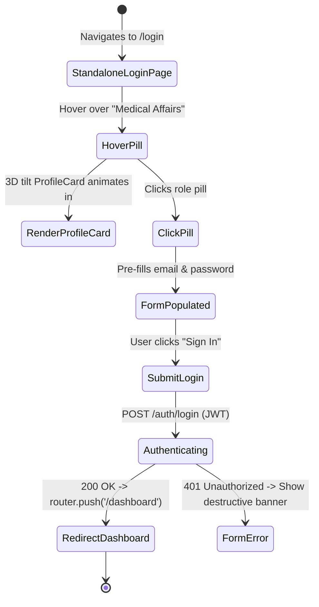
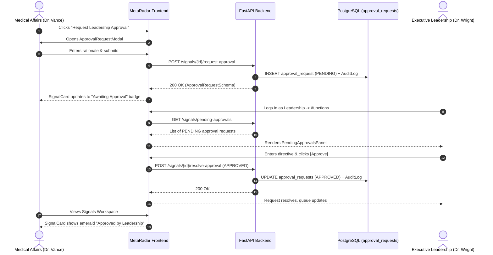

# Phase 12 — UI Design Specification (UI-SPEC.md)

**Phase:** 12 - Hackathon MVP (Final Enterprise Polish & Cross-Functional Governance)  
**Status:** Approved Specification  
**Design Reference:** MetaRadar Dark Glassmorphic Design System (`globals.css`) & Novo Nordisk Enterprise Standards  
**Target Viewports:** Desktop (1920x1080, 1440x900), Laptop (1280x800), Tablet/Responsive (1024x768)

---

## 1. Executive Summary & Design Vision

Phase 12 elevates MetaRadar from a developer-focused prototype to a **judge-ready, enterprise-grade AI Decision Intelligence platform**. The UI design contract establishes the visual language and interaction dynamics for two key workflows:

1. **Enterprise Credential Authentication & Role Discovery (`/login`):** Replaces the demo dropdown with a standalone login page featuring interactive, pointer-tracking 3D tilt **`ProfileCard`** components and one-click role pills for zero-friction judge evaluation.
2. **Cross-Functional Decision Chain & Escalation UI:** Empowers functional teams (Medical Affairs, Regulatory, Safety, Market Access, Comms) to escalate critical signals via **`ApprovalRequestModal`**, provides Executive Leadership with an actionable **`PendingApprovalsPanel`**, and visually reflects resolution badges across **`SignalCard`** feeds.

```
┌─────────────────────────────────────────────────────────────────────────────┐
│                          /login Screen Architecture                          │
│                                                                             │
│    [ MetaRadar Brand Logo + Haemophilia Radar Badge ]                       │
│                                                                             │
│    ┌─ Role Quick-Select Carousel ──────────────────────────────────────┐    │
│    │ [Med Affairs] [Regulatory] [Safety] [Market Access] [Comms] [Exec]│    │
│    └───────────────────────────────────────────────────────────────────┘    │
│            │ (Hover/Click)                                                  │
│            ▼                                                                │
│    ┌──────────────────────────────┐    ┌──────────────────────────────┐     │
│    │     3D Tilt ProfileCard      │    │     Credential Form Card     │     │
│    │  • Dr. Elena Vance           │    │  • Email: medical.affairs@.. │     │
│    │  • Medical Affairs Lead      │ ──►│  • Password: ••••••••••••••  │     │
│    │  • Online | Verified Role    │    │  • [ Sign In to Radar ]      │     │
│    └──────────────────────────────┘    └──────────────────────────────┘     │
└─────────────────────────────────────────────────────────────────────────────┘
```

---

## 2. Design System Tokens & Theming

### 2.1 Role-Based Color Palette & Accent Mapping

Every Novo Nordisk persona is visually anchored by a distinct semantic color token used across cards, badges, chips, and glowing borders:

| Role ID | Persona Display Name | Semantic Color | Light Token | Dark Token | Border Glow |
|:---|:---|:---:|:---:|:---:|:---:|
| `MEDICAL_AFFAIRS` | Dr. Elena Vance | **Emerald** | `#059669` | `#34d399` | `rgba(52, 211, 153, 0.25)` |
| `REGULATORY` | Marcus Chen | **Blue** | `#2563eb` | `#60a5fa` | `rgba(96, 165, 250, 0.25)` |
| `SAFETY` | Dr. Sarah Jenkins | **Rose / Red** | `#dc2626` | `#f87171` | `rgba(248, 113, 113, 0.25)` |
| `MARKET_ACCESS` | Henrik Lindqvist | **Amber** | `#d97706` | `#fbbf24` | `rgba(251, 191, 36, 0.25)` |
| `COMMUNICATIONS` | Claire Beaumont | **Purple** | `#7c3aed` | `#a78bfa` | `rgba(167, 139, 250, 0.25)` |
| `LEADERSHIP` | Dr. Alexander Wright | **Indigo / Cyan**| `#4f46e5` | `#818cf8` | `rgba(129, 140, 248, 0.35)` |
| `ADMIN` | System Administrator | **Slate** | `#475569` | `#94a3b8` | `rgba(148, 163, 184, 0.25)` |

### 2.2 Approval Status Badge Palette

| Status | Badge Background (Dark) | Text Color | Icon / Indicator | Tooltip Meaning |
|:---|:---|:---|:---|:---|
| `PENDING` | `rgba(245, 158, 11, 0.15)` | `#fbbf24` (Amber) | Animated Pulse Dot + Clock | "Awaiting Executive Leadership review" |
| `APPROVED` | `rgba(16, 185, 129, 0.15)` | `#34d399` (Emerald) | CheckCircle2 | "Approved by Leadership with strategic note" |
| `REJECTED` | `rgba(239, 68, 68, 0.15)` | `#f87171` (Rose) | AlertTriangle | "Returned with guidance / revision request" |

### 2.3 Typography & Surface Hierarchies

- **Display & Headings:** `Plus Jakarta Sans`, font-weights `600`, `700`, `800` (letter-spacing: `-0.025em`)
- **Body & Data:** `Inter`, font-weights `400`, `500` (letter-spacing: `0`)
- **Technical IDs & Timestamps:** `JetBrains Mono`, font-weight `500` (letter-spacing: `-0.02em`)
- **Surfaces:**
  - `Surface 0 (Background):` `#0b1220` (Dark space gradient)
  - `Surface 1 (Panel):` `#111b2b` with border `rgba(148, 163, 184, 0.12)`
  - `Surface 2 (Elevated):` `#1a2a40` with glassmorphic backdrop-filter `blur(16px)`
  - `Surface Glass:` `rgba(17, 27, 43, 0.82)`

---

## 3. Detailed Component Specifications

### 3.1 Component 1: Standalone Authentication Hub (`frontend/app/login/page.tsx` & `layout.tsx`)

#### Layout & Presentation
- **Wrapper (`layout.tsx`):** Isolated full-screen container (`min-h-screen bg-[#0b1220]`), bypassing top navigation bar, sidebar, and workspace rails.
- **Ambient Lighting:** Subtle radial background gradients (`rgba(37, 99, 199, 0.08)` and `rgba(21, 154, 156, 0.06)`) centered behind the auth card.
- **Brand Header:**
  - MetaRadar Logo with glowing radar wave indicator.
  - Subtitle: *"Enterprise Haemophilia Decision Intelligence Radar — Novo Nordisk GBS Hackathon 2026"*.

#### Section 1: Role Quick-Select Rail
- Horizontal flex row with 6 styled persona pills.
- Pill Anatomy:
  - Role Color Dot (pulsing when active).
  - Role Label (e.g. `Medical Affairs`, `Leadership`).
  - Active State: Background glow (`rgba(role_color, 0.2)`), border `1px solid role_color`.
  - Hover Interaction: Triggers live display of the persona's 3D tilt `ProfileCard`.
  - Click Interaction: Instantly populates Email & Password fields and focuses the "Sign In" button with smooth haptic feedback.

#### Section 2: Credential Card & Form
- Glassmorphic card (`bg-[#111b2b]/90 border border-slate-800 rounded-2xl p-8 shadow-2xl backdrop-blur-xl`).
- Inputs:
  - Email field (`type="email"`, auto-populated, clearable).
  - Password field (`type="password"`, auto-populated, reveal toggle).
- Submit Action:
  - Primary button with gradient sheen: *"Sign In to MetaRadar"*.
  - Loading State: Disabled button with Lucide `Loader2` spinner and label *"Authenticating..."*.
  - Error Notification: Inline destructive banner (`bg-rose-950/40 border-rose-800 text-rose-300`) with smooth fade-in.

---

### 3.2 Component 2: 3D Tilt ProfileCard (`ProfileCard.tsx` & `ProfileCard.css`)

#### Physical Card Dynamics & Tilt Matrix
The component tracks pointer movement across its bounds and updates custom CSS properties:
- `--pointer-x`, `--pointer-y` (normalized 0.0 to 1.0)
- `--rotate-x`, `--rotate-y` (clamped between -15deg and +15deg)
- `transform: perspective(1000px) rotateX(var(--rotate-x)) rotateY(var(--rotate-y)) translateZ(10px)`

#### Visual Layers
1. **Glare / Specular Layer:** Radial gradient following cursor coordinates for a realistic holographic shimmer.
2. **Card Base:** Deep obsidian glass background (`#152235/95`) with border glow matched to the persona's role color.
3. **Avatar & Badge:**
   - Persona avatar with animated glowing border.
   - Live status indicator: Green pulse dot + `"Online & Verified"`.
4. **Information Hierarchy:**
   - Display Name (`text-lg font-bold text-slate-100`).
   - Corporate Title (`text-sm font-medium text-slate-400`).
   - Internal Handle (`text-xs font-mono text-cyan-400`).
5. **Action Button:**
   - `"Select Role & Auto-Fill"` button with role-accented gradient.

---

### 3.3 Component 3: Top Navigation Role Chip (`PersonaSwitcher.tsx`)

#### Replacement Rationale
Eliminates the legacy development dropdown in favor of an authentic role status chip and authenticated session controller.

#### Visual Layout & Elements
```
┌─────────────────────────────────────────────────────────────┐
│ [● Medical Affairs]  Dr. Elena Vance  [⎋ Log Out]           │
└─────────────────────────────────────────────────────────────┘
```
- **Role Pill:** Compact badge with role color background and live pulse dot.
- **User Name:** Formatted display name visible on desktop (`text-xs font-medium text-slate-300`).
- **Logout Action:** Ghost icon button (`<LogOut size={14} />`) with tooltip *"End Session"*; triggers session cleanup and redirects to `/login`.

---

### 3.4 Component 4: Cross-Functional Approval Modal (`ApprovalRequestModal.tsx`)

#### Trigger & Invocation
Opened when a user clicks `"Request Leadership Approval"` on any `HIGH` or `CRITICAL` signal card.

#### Modal Structure
- **Backdrop:** `bg-black/70 backdrop-blur-md` with fade-in animation.
- **Header:**
  - Title: *"Request Executive Leadership Approval"*.
  - Signal summary snippet: Signal title, priority chip, and source tag.
- **Form Controls:**
  - **Urgency Level:** Radio group / segmented pill: `[ CRITICAL ]` vs `[ HIGH PRIORITY ]`.
  - **Strategic Rationale Textarea:**
    - Placeholder: *"Explain why this signal requires executive sign-off (e.g. clinical trial hold, competitor filing response, payer negotiation)..."*
    - Character counter: Minimum 20 characters required before submission is enabled.
- **Footer Actions:**
  - Cancel button (`variant="ghost"`).
  - Submit Request button (`bg-amber-600 hover:bg-amber-500 text-white`):
    - Submits to `POST /api/v1/signals/{id}/request-approval`.
    - Automatically disables on click to prevent concurrent duplicate submissions.
    - Toast feedback: *"Approval request submitted to Executive Leadership"*.

---

### 3.5 Component 5: Leadership Triage Deck (`PendingApprovalsPanel.tsx`)

#### Scope & Placement
- Rendered exclusively for `LEADERSHIP` and `ADMIN` roles at the top of `/functions` workspace.
- Highlights pending strategic decisions requiring executive intervention.

#### Panel Anatomy
- **Header Banner:**
  - Title: *"Executive Approval Queue"* with count badge (`N Pending`).
  - Subtitle: *"Cross-functional decisions escalated from Medical Affairs, Regulatory, and Safety."*
- **Approval Cards Grid/List:**
  Each pending request card displays:
  - Left column: Requesting persona pill (`Dr. Elena Vance • Medical Affairs`) + Timestamp (`2h ago`).
  - Center column: Signal Title, Priority badge (`CRITICAL`), and Request Note in a quoted callout box.
  - Right column / Action Bar:
    - Decision Note Input: Text field for strategic directive (e.g. *"Authorized. Schedule DSMB review within 7 days."*).
    - Approve Button (`bg-emerald-600 hover:bg-emerald-500` with `<CheckCircle2 />`).
    - Return/Reject Button (`bg-rose-600/80 hover:bg-rose-600` with `<XCircle />`).
- **Interactive State Transitions:**
  - On submit: Card smoothly transitions out with green/red flash; live counter decrements.
  - Empty State: When 0 pending items, displays a clean illustrated empty card: *"All functional approval requests have been resolved."*

---

### 3.6 Component 6: Signal Card Status Integration (`SignalCard.tsx`)

#### Dynamic Approval Section
Inserted immediately below the 4-question decision pills and above the source footer:

```
┌─────────────────────────────────────────────────────────────┐
│ ⚡ SIGNAL: NXT007 Phase III readout update...               │
│ Priority: [ CRITICAL (94) ]  Source: [ ClinicalTrials.gov ] │
│                                                             │
│ ┌─ Approval Status ───────────────────────────────────────┐ │
│ │ ⏳ Awaiting Leadership Approval (Requested by Med Affairs)│ │
│ └─────────────────────────────────────────────────────────┘ │
│                                                             │
│ [ View Evidence ] [ Trace ] [ Red-Team ] [ Request Approval]│
└─────────────────────────────────────────────────────────────┘
```

- If `approval_status === 'PENDING'`:
  - Renders amber container with animated clock icon and tooltip showing request timestamp and note.
- If `approval_status === 'APPROVED'`:
  - Renders emerald container: `✓ Approved by Leadership: "<Resolution Note>"` (with author & timestamp).
- If `approval_status === 'REJECTED'`:
  - Renders rose container: `✗ Returned with guidance: "<Resolution Note>"`.
- If no approval requested:
  - Non-Leadership roles see `"Request Leadership Approval"` button.
  - Leadership/Admin roles see `"Escalate / Review"` link.

---

### 3.7 Component 7: Dashboard Hero Executive Alert (`metaradar.tsx`)

For `LEADERSHIP` and `ADMIN` users on the primary `/dashboard` view:
- A prominent dismissable banner appears in the hero section:
  > **⚠️ Strategic Attention Required:** You have **2 signals** awaiting executive approval from Medical Affairs and Regulatory.  
  > `[ Review Pending Approvals → ]` *(Deep links to `/functions`)*

---

## 4. State Machines & User Interaction Flows

### Flow 1: Zero-Friction Hackathon Login Flow


### Flow 2: Cross-Functional Approval & Governance Flow


---

## 5. Verification & Quality Assurance Gates

| Gate # | Check Description | Verification Command / Method | Acceptance Criteria |
|:---|:---|:---|:---|
| **V-01** | TypeScript Strict Compilation | `npx tsc --noEmit` | 0 errors across all new and modified components |
| **V-02** | ESLint Code Quality | `npm run lint` | 0 lint or syntax errors |
| **V-03** | Standalone `/login` Isolation | Browser Navigation | `/login` renders without top navbar or sidebar wrapper |
| **V-04** | 3D Tilt Card Performance | Pointer Tracking Stress Test | 60 FPS smooth rendering, no layout thrashing or CLS |
| **V-05** | Form Autofill Synchrony | Pill Click Evaluation | Clicking any of the 6 pills updates form inputs instantly |
| **V-06** | Approval Modal Validation | Form Submission | Submit disabled if justification < 20 chars; double-click prevented |
| **V-07** | RBAC Isolation on Panels | Multi-User Role Testing | `PendingApprovalsPanel` visible only to `LEADERSHIP` and `ADMIN` |
| **V-08** | Audit Log Recording | Backend Integration Tests | Every request and resolution creates immutable `AuditLog` entry |

---

## 6. Sign-Off & Execution Readiness

This UI design contract is finalized, fully aligned with the **100-Point Novo Nordisk GBS Hackathon Rubric**, and ready for immediate implementation in Phase 12 execution waves.
