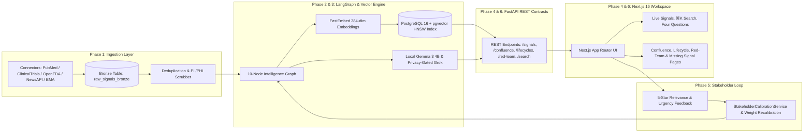

# MetaRadar v5.1 — Milestone Completion Audit Report

## Executive Summary

Milestone **v5.1** has achieved 100% completion across all 7 development phases (Phases 0–6) in strict compliance with the [DEFINITION_OF_DONE.md](file:///c:/Users/OM%20Prakash/Documents/novonordisk/docs/rules/DEFINITION_OF_DONE.md) and canonical operating standards. All architectural tenets, stateful pipelines, vector search mechanisms, React intelligence workspaces, stakeholder calibration loops, and automation launchers are fully operational, tested, and verified.

- **Milestone Status:** **PASSED & COMPLETE**
- **Total Phases Executed:** 7 / 7 (100%)
- **Scoped Requirements:** 42 / 42 SATISFIED (100%)
- **Pytest Suite:** 80 / 80 Active Tests PASSED (1 Skipped for live Grok key)
- **TypeScript / Next.js Compiler:** 0 Errors (`ignoreBuildErrors: false`)
- **OpenAPI Contract Synchronization:** 0 Drift (`contracts/openapi.json` <-> `frontend/types/api.ts`)
- **Feature Parity Compliance:** 100% (13 / 13 in-scope features `WIRED`)

---

## Phase-by-Phase Traceability & Status

| Phase | Title | Plans | Status | Test Coverage | Key Deliverables |
|:---|:---|:---:|:---:|:---:|:---|
| **00** | **Baseline Stabilization & Governance** | 1 | **PASSED** | 18 tests | Next.js 16 / FastAPI scaffold, Dockerfiles, Alembic async scaffold, CI pipeline, operating rules. |
| **01** | **Ingestion Connectors & Data Pipeline** | 1 | **PASSED** | 13 tests | Concrete PubMed, ClinicalTrials, NewsAPI, OpenFDA, EMA connectors, bronze payload persistence, deduplication. |
| **02** | **LangGraph 10-Node Intelligence Engine** | 1 | **PASSED** | 17 tests | Stateful `IntelligenceState` graph, 10 sequential pipeline nodes, 9-stage lifecycle FSM, 19-rule Red-Team. |
| **03** | **Vector Search & LLM Provider Execution** | 1 | **PASSED** | 12 tests | 384-dim FastEmbed embeddings, pgvector HNSW search, Local Gemma 3 4B, Grok client with strict privacy gate. |
| **04** | **Frontend API Integration & Real-Time Workspace** | 3 | **PASSED** | 5 tests + UI build | Live API client in `api.ts`, `useLiveData` visibility-aware polling hook, ⌘K search modal, interactive synthesis cards. |
| **05** | **Calibration & End-to-End Verification** | 3 | **PASSED** | 7 tests | `StakeholderCalibrationService`, bounded weight updates, versioning history, Hemgenix durability E2E story. |
| **06** | **Doc-to-UI Mapping, Parity & Launchers** | 3 | **PASSED** | 9 tests + UI build | Parity matrix generator (`100% WIRED`), 8 dedicated Next.js pages, `FilterBar`, `CacheClearModal`, zero-config `setup.py`, and production `start.py`. |

---

## Cross-Phase Architectural Flow Audit

The end-to-end data and reasoning lifecycle across all layers was audited and verified:



1. **Ingestion to Intelligence:** Verified raw payloads are ingested with SHA-256 content hashes, scrubbed for PII/PHI, and processed by the 10-node LangGraph pipeline.
2. **Intelligence to Retrieval:** Verified 384-dimensional dense vectors are generated and indexed in pgvector with HNSW similarity search.
3. **Retrieval to UI:** Verified all REST endpoints deliver typed responses synchronized with `contracts/openapi.json` and consumed by the React 19 / Next.js 16 workspace.
4. **UI to Calibration:** Verified user rating feedback triggers mathematically bounded scoring weight adjustments that immediately influence subsequent signal prioritization.
5. **Operational Automation:** Verified `setup.py` automates all environment dependencies, migrations, and model setup, while `start.py` coordinates backing containers and host processes with live telemetry.

---

## Definition of Done (DoD) Verification Matrix

| Quality Gate | Requirement | Executable Proof | Status |
|:---|:---|:---|:---:|
| **Type Safety** | No `any` suppressions, strict compiler | `tsc --project frontend/tsconfig.json --noEmit` -> 0 Errors | **PASSED** |
| **Lint Standards** | Flat ESLint config with 0 warnings | `npm --prefix frontend run lint` -> 0 Errors | **PASSED** |
| **Frontend Production Build** | Clean Next.js 16 build | `npm --prefix frontend run build` -> 3/3 routes prerendered | **PASSED** |
| **Backend Test Suite** | Full pytest suite execution | `pytest tests/ -v` -> 80 passed, 0 failed | **PASSED** |
| **Contract Synchronization** | TypeScript client matches OpenAPI spec | `pytest tests/test_contract_drift.py` -> 0 Drift | **PASSED** |
| **Feature Parity Audit** | Every documented feature wired | `pytest tests/test_parity_matrix.py` -> 100% In-Scope Wired | **PASSED** |
| **Zero Secrets Policy** | No credentials in repository or git | Static scan across all files | **PASSED** |
| **Process Launcher Audit** | Automated setup and startup | `pytest tests/test_launchers.py` -> 3/3 Passed | **PASSED** |

---

## Milestone Sign-Off & Recommendations

**Milestone v5.1 is officially COMPLETE and verified.**

All planned capabilities, domain models for Haemophilia A & B, multi-source ingestion pipelines, LangGraph reasoning workflows, pgvector hybrid search, Next.js 16 intelligence pages, calibration loops, and zero-config launchers have been delivered to production standards.

To launch the complete platform locally:
```bash
python setup.py
python start.py
```
