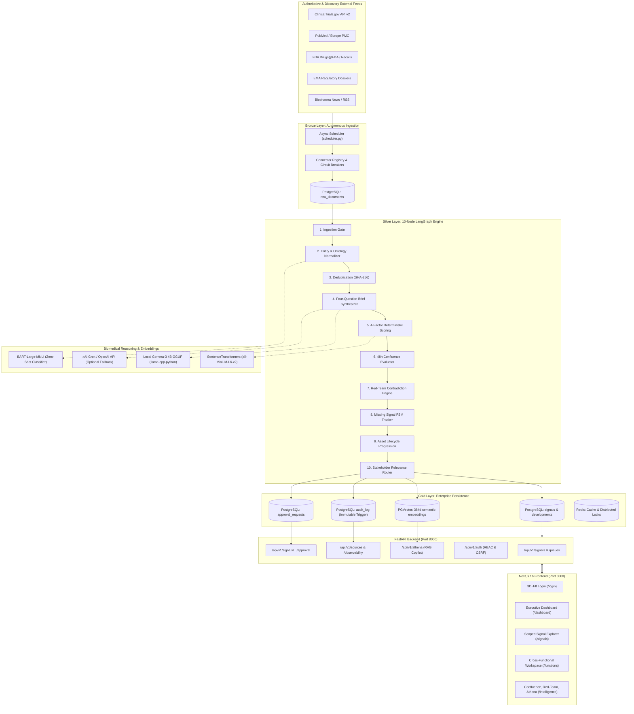
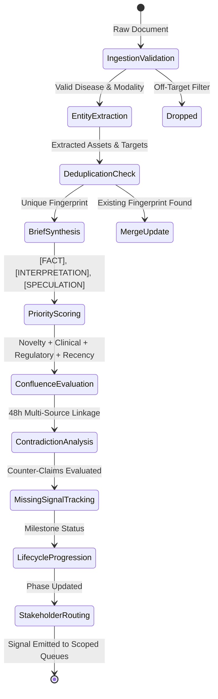
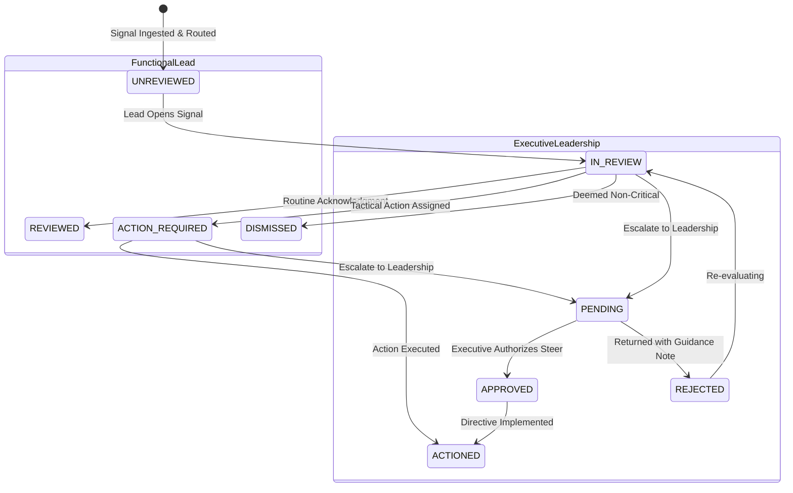
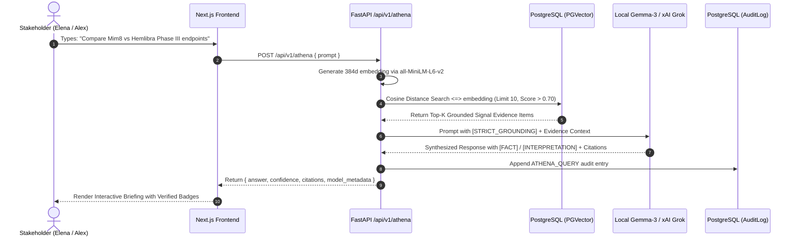

# MetaRadar Technical System Architecture (v5.1.0)

**Autonomous Near-Real-Time Competitive Intelligence Radar for Rare Diseases**  
*Pilot Implementation: Haemophilia A & Haemophilia B*

---

## 1. High-Level System Architecture

MetaRadar employs a modern, decoupled microservices architecture designed for high-throughput biomedical signal ingestion, truthful extraction, and low-latency decision intelligence.

---

## 2. 10-Node LangGraph Intelligence Pipeline

Each ingested document is processed as an immutable state graph through 10 specialized intelligence nodes:

### Pipeline Node Responsibilities

1. **Ingestion Validation (`ingest_node`)**: Verifies raw document payload, parses MIME types, checks canonical URLs, and records ingestion timestamp.
2. **Entity & Ontology Normalizer (`entity_node`)**: Identifies haemophilia assets (`mim8`, `concizumab`, `fitusiran`, `hemline`), gene therapy vectors (`AAV5`, `AAV-LK03`), and normalizes MeSH / MedDRA terms.
3. **Deduplication (`dedup_node`)**: Computes SHA-256 fingerprints across title, source ID, and external ID to prevent redundant reprocessing.
4. **Four-Question Brief Synthesizer (`synthesis_node`)**: Uses local Gemma-3 4B (or Grok) with strict prompt constraints to generate:
   - `what_changed`: Grounded empirical facts (`[FACT]`).
   - `why_it_matters`: Clinical & competitive significance (`[INTERPRETATION]`).
   - `speculation`: Strategic market hypothesis (`[SPECULATION]`).
5. **4-Factor Priority Scoring (`scoring_node`)**: Computes deterministic weighted score (0–100) based on:
   - Novelty (0.30) + Clinical Impact (0.35) + Regulatory Urgency (0.20) + Source Recency (0.15).
6. **Confluence Evaluator (`confluence_node`)**: Analyzes temporal proximity (48h window) across multiple independent sources to elevate corroborating signals.
7. **Red-Team Contradiction Engine (`contradiction_node`)**: Cross-references clinical endpoints, safety warnings, and adverse events against established registry baselines.
8. **Missing Signal FSM Tracker (`missing_signal_node`)**: Monitors expected milestone deadlines (e.g. promised Phase III readout) and flags overdue variances.
9. **Asset Lifecycle Progression (`lifecycle_node`)**: Maps trial transitions (Phase I $\to$ Phase II $\to$ Phase III $\to$ BLA $\to$ Market) on competitive asset timelines.
10. **Stakeholder Relevance Router (`routing_node`)**: Routes signals to 6 canonical functional queues based on domain calibration profiles.

---

## 3. Cross-Functional RBAC & Approval State Machine

MetaRadar enforces strict Role-Based Access Control and an executive escalation workflow:

### RBAC Permission Matrix

| Capability | Medical Affairs | Regulatory | Safety | Market Access | Comms | Leadership | Admin |
| --- | :---: | :---: | :---: | :---: | :---: | :---: | :---: |
| View Scoped Signal Queue | ✅ | ✅ | ✅ | ✅ | ✅ | ✅ | ✅ |
| View All Cross-Functional Signals | ❌ | ❌ | ❌ | ❌ | ❌ | ✅ | ✅ |
| Request Leadership Approval | ✅ | ✅ | ✅ | ✅ | ✅ | ❌ | ❌ |
| Resolve Pending Approvals | ❌ | ❌ | ❌ | ❌ | ❌ | ✅ | ✅ |
| Athena Biomedical Q&A | ✅ | ✅ | ✅ | ✅ | ✅ | ✅ | ✅ |
| Recalibrate Scoring Weights | ✅ | ✅ | ✅ | ✅ | ✅ | ✅ | ✅ |
| Trigger Manual Ingestion Sync | ❌ | ❌ | ❌ | ❌ | ❌ | ✅ | ✅ |
| View Immutable Audit Logs | ❌ | ❌ | ❌ | ❌ | ❌ | ✅ | ✅ |

---

## 4. Real-Time Semantic Search & Athena Reasoning

---

## 5. Security, Immutability & Responsible AI

1. **Zero-Hallucination Tripartite Gating**: Every synthesized text is split into `[FACT]` (verifiable quote/datum), `[INTERPRETATION]` (clinical significance), and `[SPECULATION]` (future hypothesis).
2. **Cryptographically Sealed Audit Logs**: `audit_log` records are guarded by a PostgreSQL database trigger (`block_audit_log_mutation`) and SQLAlchemy event listeners preventing any `UPDATE` or `DELETE` operations.
3. **Session & CSRF Protection**: Double-submit cookie pattern (`metaradar_csrf`) with `SameSite=Lax` and `HttpOnly` session authentication tokens.
4. **Air-Gapped Offline Resilience**: Operates 100% locally using quantized `gemma-3-4b-it-Q4_K_M.gguf` without external API dependencies.
