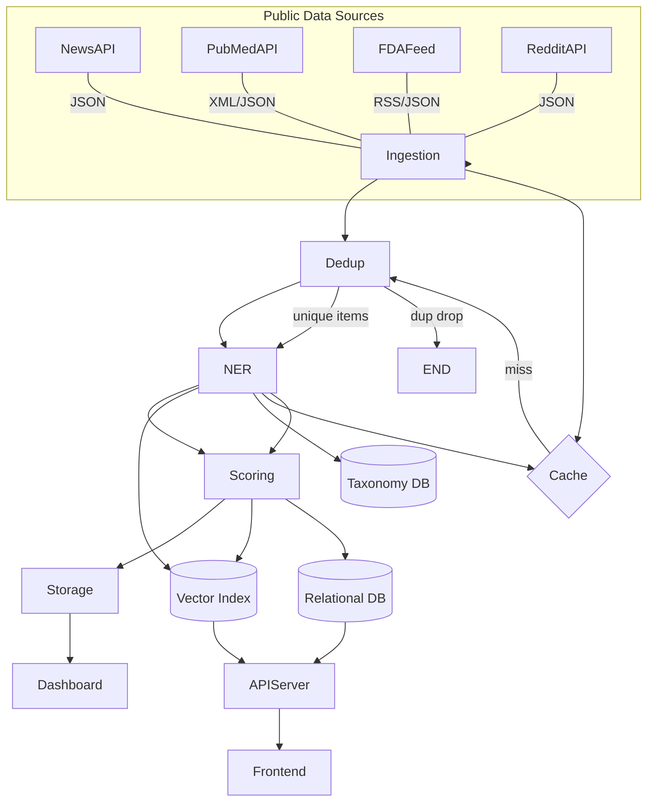

# Executive Summary

MetaRadar is essentially a **cloud-native ETL pipeline** tailored for pharmaceutical competitive intelligence, combining **microservices** and **RAG-style** AI components.  It continuously pulls data from public sources (news, PubMed, FDA, social media), deduplicates and extracts entities via NLP, and stores structured “signals” in Postgres + Weaviate, with FastAPI serving a Next.js dashboard.  Key strengths of this design include role-specific filtering and up-to-date context for summaries (a “retrieval-augmented” approach).  

However, the pipeline has multiple **gaps and risks**: unreliable data ingestion, duplicate/missing signals, NLP extraction errors, outdated taxonomy, subjective scoring, scaling limits (DB, cache, LLM calls), frontend/API latency, and compliance issues.  For each risk we recommend concrete fixes (e.g. retry/queue logic, fuzzy dedupe, improved NER, CI/CD, logging, etc.) and explicit **B.Pharm integration points** for human validation.  We outline **databases, LLMs, and hosting alternatives** (with cost/complexity tradeoffs), propose testing and monitoring strategies, and emphasize security/compliance (audit trails, encryption, HIPAA/GxP).  Diagrams and JSON schemas illustrate the data flow and key entities.  Finally, we present a **prioritized action plan**: short-term hackathon MVP tasks, medium-term enhancements, and long-term production hardening.

---

## 1. Architecture & Patterns

MetaRadar follows a **pipeline-oriented microservices** architecture (an ETL/streaming design) with **event-driven ingestion** and RAG elements.  Each component is deployed in containers (Docker/Kubernetes) and communicates via APIs or message queues.  

- **Ingestion/ETL:** Scheduled or event-driven jobs fetch new articles from NewsAPI, PubMed API, FDA RSS, etc. (ETL batch or streaming style).  For example, AWS Lambda+EventBridge is one common pattern to poll sources on a schedule and trigger downstream processing.  
- **Microservices:** The pipeline is split into services (ingestion, deduplication, NLP, scoring, trend detection, API/backend, frontend). This aligns with modern pharma/health software trends where monolithic systems break into independent services. Each service can be written in the best suited language (e.g. Python for NLP, Go or Node.js for API), run in a container, and scaled independently. Services communicate via REST or message queues (e.g. RabbitMQ or Kafka) for decoupling.

- **RAG/LangChain-style components:** The use of Weaviate (vector DB) plus LLMs (BART-based summaries or local LLM) is a classic retrieval-augmented workflow. In RAG, the system retrieves relevant knowledge (e.g. similar news or taxonomy entries from Weaviate) to ground LLM summarization. We implement a simplified RAG: articles are embedded and stored, allowing semantic search (in Weaviate), and BART (a smaller seq2seq LLM) or a local LLM generates summaries. This hybrid design mitigates hallucinations by relying on indexed content.  

- **ETL vs Streaming:** The pipeline is mostly **near-real-time ETL**, not continuous streaming. Data arrives in bursts (when articles are published). However, it can be extended to streaming (e.g. using Kafka or AWS Kinesis if volume grows). Either way, we treat it like an ETL job that runs frequently (every few minutes) and loads new data. This is backed by Weaviate’s incremental ingestion and a Postgres append-only table.  

- **Caching:** We use Redis as a distributed cache to speed up frequent lookups (e.g. caching Weaviate/vector results or API query results). Caching is crucial: a shared Redis can store recently seen signals or taxonomies. Distributed caching “improves performance and scalability” by reducing repeated DB queries. For example, cache the JSON of trending signals so the dashboard can refresh without hitting the database each time.

- **Architectural style:** This is a **microservices/data pipeline** architecture with partial **event-driven** characteristics (scheduled triggers, pub/sub between services) and **RAG**/embedding-assisted components. The overall style is **cloud-native ETL + RAG**. A high-level component diagram:

```mermaid
flowchart TD
    subgraph DataSources [Public Sources]
      A(PubMed API) 
      B(FDA API)
      C(News API)
      D(Reddit/Social)
    end
    DataSources --> IngestService[Data Ingestion Service]
    IngestService --> CleanEngine[Cleaning & Deduplication]
    CleanEngine --> NLPService[NLP/Entity Extraction]
    NLPService --> Scoring[Signal Scoring & Trend Detection]
    Scoring --> PostgreSQL[(Postgres DB)]
    Scoring --> Weaviate[(Weaviate Vector Store)]
    NLPService --> Weaviate
    PostgreSQL --> APIService[Backend API (FastAPI)]
    Weaviate --> APIService
    APIService --> Frontend[Dashboard (Next.js)]
    Frontend -->|User Access| Users[(Medical Affairs Users)]
```

This diagram shows the data flow from sources through ingestion, cleaning, NLP extraction, scoring, into storage and the dashboard UI. The **Frontend** (Next.js) calls the FastAPI **Backend**, which queries both Postgres (for structured signals) and Weaviate (for semantic search or taxonomy lookup).

**Comparison to typical news dashboards:** Unlike a generic news reader, MetaRadar is **signal-focused** and **role-specific**. It continuously ingests many sources (not just one feed) and applies NLP to **identify pharma entities**. It filters information by clinical importance (not just recency) and by department needs. Its unique combination of vector search, medical taxonomy, and scoring for relevance makes it a true competitive intelligence system rather than a simple RSS aggregator.

---

## 2. Gaps, Risks & Mitigations

Below we break down each pipeline stage, identify potential failure modes, and propose fixes.

### Data Ingestion

- **Risk: Source reliability and quotas.** APIs (NewsAPI, PubMed, etc.) can fail or rate-limit. PDF scraping (for PubMed) may break. If a source changes schema, ingestion can silently drop data.

  **Fix:** Implement robust ingestion with retries, exponential backoff, and alerting. For example, use a worker that catches HTTP exceptions and retries (e.g. `requests` with retry or `httpx` with backoff). Log failures to monitoring (to catch broken parsers). Use caching (Redis) for intermediate data to recover from transient failures. Also **queue** ingested items (e.g. with RabbitMQ or Kafka) so temporary source outages don’t drop data; the queue can buffer and retry ingestion.

  **Code/Tools:** In Python, use `tenacity` or `httpx.AsyncClient` with retry logic. Protect API keys in environment vars or AWS Secrets. Use AWS EventBridge/Cron jobs or CloudWatch triggers (for AWS) to schedule fetches. Store raw JSON in a “bronze” table or S3 (backup) for replay.

- **Risk: Duplicate and near-duplicate articles.** Same news may appear from multiple APIs (e.g. Reuters via NewsAPI vs a scraped RSS). If not deduplicated, users see duplicates as separate signals.

  **Fix:** After ingestion, run **fuzzy matching** or hashing to merge duplicates. For example, compute a text hash (MinHash or simhash) on article content and cluster similar ones. Python’s `fuzzywuzzy` or `difflib` can find high-similarity titles. Store a canonical record, and drop or link duplicates.  

  **References:** Near-duplicate detection algorithms are well known (shingles, SimHash). A simple approach: normalize text (lowercase, remove stopwords), then compare Jaccard similarity; if > threshold, mark duplicate. Use PostgreSQL trigram indexes (`pg_trgm`) to find similar titles, or keep a local in-memory set of recently seen hashes.

### NLP / Entity Extraction

- **Risk: Entity recognition errors.** The NLP model (spaCy or BERT) may misidentify drugs, companies, diseases or miss synonyms. Pharma terms (GLP-1, subcutaneous) might confuse off-the-shelf models.

  **Fix:** **Custom NER / ontology injection.** Use a pharma-specific list of drug names, companies, diseases (provided by B.Pharm team) to train or supplement the NER. For example, spaCy’s EntityRuler or fine-tuning can boost recognition. Periodically update the knowledge base of terms (see taxonomy section below).  

  **Integration:** B.Pharm team should **curate the entity lists** and seed the NER. In code, this could be a dictionary lookup before/after model inference: if “semaglutide” appears, tag it as DRUG. Use libraries like HuggingFace transformers (BioBERT) for clinical NER, or spaCy with medspacy plugins.

- **Risk: Misclassification of context.** Even if entities are found, understanding their role (e.g. a drug name vs a research method) can be wrong.

  **Fix:** Add **contextual filters**. For example, only accept a term as a drug if surrounding words match clinical contexts (“Phase III semaglutide trial”). Combine rule-based checks (regex on “phase [I|II|III|IV]” etc.) with statistical models. Highlight ambiguous cases to B.Pharm reviewers in a validation UI (below).

- **Risk: Evolving vocabulary.** New drugs or companies might appear that aren’t in the model’s vocabulary.

  **Fix:** Maintain a **dynamic taxonomy/knowledge base** (see below). When novel terms appear, log them and have experts vet and add them. For example, log unknown capitalized words (using POS tags) from each article and review weekly.

### Taxonomy & Knowledge Base

- **Risk: Incomplete or outdated taxonomy.** The system’s knowledge of drug classes, indications, competitors etc. may be incomplete, leading to missing signal classification or poor ranking.

  **Fix:** **Domain experts maintain taxonomy.** B.Pharm students should build a JSON-based pharmaceutical taxonomy (entities with fields: class, indications, company, synonyms, competitor names, etc.). This could live in Weaviate or an internal module. Use the taxonomy to enrich signals (e.g. linking “semaglutide” to “GLP-1 agonist” and “anti-obesity drug”).  

  **UI/Workflow:** Provide a simple admin interface (e.g. in Next.js) where pharm team can add new taxonomy entries and verify extracted entities. For instance, display a list of entities needing classification (“Semaglutide” – confirm class and indications) and let experts tag them. This human-in-the-loop will prevent drift and improve NER accuracy.

### Scoring & Relevance

- **Risk: Mis-scoring events (false positives/negatives).** A trivial news (“company opens office”) might rank too high, or a critical trial failure might rank too low.

  **Fix:** Define a **scoring rubric** aligned with Medical Affairs priorities. For example, assign higher weights to terms like “Phase III”, “approved”, “failed”, “FDA”, “obesity”. Use training data (past signals) to tune. The B.Pharm team should review signal examples and tune weights or thresholds.

  **Implementation:** The scoring service could be a rule-based engine or ML model. For code-level, simple rules first (if “Phase III” and “weight loss” in text → +5 points). Use libraries like Scikit-learn if you want a trainable classifier. Always normalize by source credibility (FDA source > blog, etc.).  

  **UI:** In the dashboard, flag signals with their score and allow experts to mark “relevant/not relevant” as feedback. That feedback can retrain or adjust the scoring algorithm.

### Storage & Search

- **Risk: Database scaling.** Postgres might become large if we store all raw text. Vector DB (Weaviate) can be expensive or slow at high volume.

  **Fix:** Archive old raw text. Keep Postgres for metadata and signals (titles, links, dates, extracted fields). Offload raw content to cost-effective storage (e.g. S3). For Weaviate, keep only embeddings and references. Partition or shard if needed.

  **Tech choices:** Weaviate vs alternatives: (see Tech table). For lower budgets, `pgvector` extension might suffice for <=10M vectors. For large scale, Milvus or Elastic could be considered. In any case, ensure indexes are created (Postgres GIN on text/JSON, Weaviate HNSW params tuned).

### Caching & Performance

- **Risk: API and query latency.** Without caching, every page view will query Postgres + Weaviate + LLMs, causing slow response.

  **Fix:** Use Redis caching for frequent queries and expensive operations. For example, cache the “top 10 signals” list for each role for a few minutes. Use **cache-aside pattern**: on API request, check Redis; if miss, compute and populate cache. Redis may also store ephemeral intermediate results (e.g. monthly computation of trending topics).  

  **Reference:** Caching “reduces repeated computations or database queries”. CDNs or edge caching could be used for static dashboard assets.

- **Risk: Memory/CPU spikes.** Vector searches and LLM calls can consume a lot of RAM/CPU.

  **Fix:** Limit query sizes (batch requests), and use rate limiting. Host Weaviate and LLMs on GPU-enabled nodes if possible. Consider **autoscaling** for these services based on load (Kubernetes HPA or cloud autoscaling groups). Optimize embeddings (e.g. use smaller models like OpenAI Ada for embeddings if allowed, or Distil models).

### APIs & Frontend

- **Risk: Backend errors / crashing.** Without validation, APIs might fail on unexpected data or load, bringing down the service.

  **Fix:** Write **schema validations** (Pydantic models in FastAPI) for all incoming/outgoing JSON. For example, define schemas for Article and Signal (see JSON schema below). FastAPI will reject invalid data before DB insertion. Also add exception handlers to log unexpected errors and return sanitized messages.

- **Risk: CORS/auth issues.** If the dashboard is separate, ensure proper CORS settings. Also, the hackathon might assume open access, but in production one should add authentication (OAuth2, API keys).

  **Fix:** Configure CORS in FastAPI to allow the dashboard’s domain. Plan to add auth (e.g. JWT or OAuth2 via Azure/Google/Facebook, or corporate SSO if Novo requires). Even a basic auth or API token check can help prevent misuse.

- **Risk: Frontend performance.** Rendering graphs on large data sets or loading many assets can be slow.

  **Fix:** Use pagination/lazy loading. Pre-compute trends daily. Serve static assets (JS, CSS) via CDN. Use a lightweight chart library (Recharts or Chart.js). Minimize client-side data fetches by bundling and caching as much as possible.

### Deployment & CI/CD

- **Risk: Environment drift.** Differences between dev and prod (e.g. missing env vars, docker inconsistencies) can cause failures.

  **Fix:** Use **Infrastructure-as-Code** (Terraform, Kubernetes YAML) and Docker containers for all services. Ensure *immutable deployment*: build Docker images in CI and deploy the same image to all environments (dev/test/prod). Use GitHub Actions or GitLab CI to automate tests and deployments.

  **Example CLI:** 
  ```bash
  docker build -t metaradar/api:latest -f Dockerfile.api .
  docker push myregistry/metaradar/api:latest
  kubectl set image deployment/api metaradar=myregistry/metaradar/api:latest --namespace=prod
  ```
  or use `kubectl apply` with Helm charts.

- **Risk: No rollbacks or testing.** Without CI, bugs slip to prod.

  **Fix:** Adopt a CI/CD pipeline. Each pull request should run unit tests (pytest for Python, Jest/RTL for Next.js). On merge to main, run a staging deployment (on preview namespace) and e2e tests (Cypress) that simulate user flows (e.g. load dashboard, fetch signals). Then approve for production. Use feature flags for risky features.  

  **References:** FastAPI can be tested with pytest `TestClient` and dependency overrides, and Next.js can use Jest + React Testing Library. Integration tests: spin up a test Postgres and Redis in CI (GitHub Actions can use `services:`). After deploy, run smoke tests (e.g. GET `/health` endpoint).

- **Risk: Monitoring and Observability missing.** Without logs/metrics, you won’t know when something breaks.

  **Fix:** Integrate **application metrics** and alerting. Use Prometheus + Grafana (or cloud monitoring) to track request latency, error rates, queue lengths, DB size, and LLM API usage. For example, instrument FastAPI with Prometheus client to count requests per endpoint; monitor Redis hit ratio; log to a centralized system (ELK or Grafana Loki).  

  **Metrics:** 
  - Ingestion success/fail count per source
  - NLP errors (exceptions, NER misses)
  - Number of signals per day
  - Dashboard response time
  - LLM call latency & count (token usage)
  - Redis/Weaviate cache hit rates

  **Alerts:** Error rates spiking, ingestion queue backlog, or any service down should trigger an alert (Slack/email). **Logging:** Ensure all microservices log context (request IDs, errors) with timestamps so incidents can be audited (FDA 21 CFR Part 11 requires audit trails).

---

## 3. Human-in-the-Loop Validation

The B.Pharm team’s role is to teach the system **what is medically important**. Key integration points:

- **Entity Validation:** After NLP extracts entities (drug names, diseases, phases), present them in a simple UI. For example, a React page listing “Review extracted entities” with entries like:  
  ```
  Article: "Novo Nordisk begins Phase III semaglutide trial."
  Extracted: Drug=Semaglutide, Company=Novo Nordisk, Phase=Phase III, Disease=Obesity.
  [✓ Correct] [X Incorrect: ] [Text correction: ______]
  ```
  The students check these. Backend logs any corrections to refine the NER model/rules.

- **Taxonomy Editing:** A searchable table UI of taxonomy entries (drugs, classes, indications). Each row: drug name, company, class, indications, competitors. Students can add/edit entries. For example, add a new competitor name or flag two drugs as the same class. This syncs to the knowledge store (could be stored in Weaviate or a JSON file in DB). Code snippet (REST API):
  ```python
  @app.post("/taxonomy/drug")
  def add_drug_entry(entry: DrugTaxonomy):
      db.insert("drug_taxonomy", entry.dict())
  ```
  A Next.js admin page calls this API.

- **Signal Review:** Periodically, expert review of the top signals. The dashboard could have a “validation mode” where a medical reviewer can mark a signal as true/false or annotate additional context. This feedback is logged and used to adjust scoring logic.

- **Medical Summaries:** If BART or LLM generates an “AI summary” of each signal, let experts review them. E.g. each signal card could show the 1-line summary and a “Mark as accurate/inaccurate” toggle. If inaccurate, the team can correct it. Over time, these corrections can be used to fine-tune a better summarizer or filter out hallucinations.

**Workflow:** Use a simple Next.js protected route (only accessible to hackathon team) with forms. Even a Google Sheet or Airtable could suffice at first for collecting feedback.

---

## 4. Performance, Consistency & Cost Trade-offs

- **Performance vs Freshness:** Frequently updating the knowledge base (more ingestion, more NLP runs) yields fresher signals but uses more compute and API calls. We can batch-run expensive tasks (like retraining embeddings) during off-peak hours. E.g. update the Weaviate index nightly.

- **Consistency vs Latency:** Weaviate updates may be eventually consistent. For critical alerts (like FDA announcements), consider a priority queue that pushes them immediately to users via a “real-time alert” path (webhook/Push).

- **Cost trade-offs:** 
  - **Vector DB:** Self-hosted (Weaviate, Milvus) has low license cost but ops overhead. Managed (Pinecone) is easier but usage-based and expensive at scale. If data is small (<10M vectors), `pgvector` on Postgres (no extra cost) could suffice.
  - **LLM Inference:** Using a cloud API (OpenAI GPT) gives high quality but high cost per token; local models (Llama2, Mistral) cost mainly hardware and are one-time. Evaluate budget: if on AWS, a GPU instance vs on-prem.
  - **Caching vs Compute:** More caching (Redis) costs a bit more memory but saves CPU on DB/LLM calls. For example, caching query results can reduce vector DB queries and speed up the dashboard (thus saving on Weaviate requests).
  
- **Scaling:** 
  - **Horizontal:** We can scale services (Kubernetes pods) when CPU/memory high. E.g. autoscale the ingestion worker if backlog grows. 
  - **Vertical:** Use stronger instances for LLM if needed. For small teams/hackathon scale, focus on horizontal scaling of stateless services.
  
- **Data Storage vs Cost:** Weaviate’s premium tier has fees. If costs are too high, consider embedding batching or pruning old vectors. You might reduce dimensionality of vectors (e.g. using smaller embeddings) to save space and speed queries.
  
- **Monitoring Overhead:** More monitoring (high-resolution metrics) can itself cost (storage). Balance detail vs cost. Use sampling (e.g. record 1 in N events) for high-volume endpoints.

---

## 5. Testing Strategies & Metrics

**Testing:** Cover all layers.

- **Unit Tests:** For each service. E.g. FastAPI endpoints should have pytest functions using `TestClient` (or dependency overrides). Mock external calls (NewsAPI, Weaviate) to isolate logic. For React, use Jest + React Testing Library to test components (dashboard views, form inputs).

- **Integration Tests:** Spin up real containers (Postgres, Redis) in CI (with Docker Compose or GitHub Actions services). Test the whole pipeline on synthetic data. For example, feed a known article JSON to the ingestion service, assert that a signal record appears in Postgres with correct fields. Use **pytest fixtures** to stand up and tear down test instances.

- **End-to-End (E2E):** Use a tool like Cypress or Playwright to simulate user interaction: log in to dashboard (if any), load signals, apply filters. Run these against a test deployment or local environment. Include negative tests (no sources, empty results).

- **Synthetic Datasets:** For NER and scoring, create synthetic articles that cover edge cases (missing fields, rare words). Use them in unit tests for NLP (e.g. ensure “GLP-1” is tagged). For scaling tests, generate large amounts of fake news entries (e.g. 100k articles) to benchmark ingestion and DB load.

- **Metrics & Alerts:** Define SLIs/SLOs, e.g. 99% of dashboard queries <1s latency; ingestion within 5 minutes of publication. Monitor:
  - **Uptime:** endpoint  `/health` should return OK. 
  - **Response Times:** average and percentile for API calls.
  - **Error Rates:** increase in 4xx/5xx triggers alert.
  - **Data Freshness:** track timestamp of latest ingested item; alert if stale (> threshold).
  - **Queue Backlog:** if you use a message queue, monitor its depth.

**Tools:** Use Prometheus for metrics; Grafana or cloud alerts (AWS CloudWatch) for triggers. Log structured JSON (via `logging` module) so queries (e.g. “error” logs) can be automated. 

---

## 6. Security, Privacy & Compliance

Although MetaRadar processes public data, there are still concerns:

- **Authentication & Access Control:** Ensure only authorized users (company employees) access the dashboard. Implement SSO or at least password-protected accounts. **Role-based access**: e.g. a Regulatory user should not see Commerce-only data, aligning with FDA regulations on data segmentation.

- **Audit Trails:** For any edits (taxonomy changes, score adjustments), log user ID, action, timestamp. This supports GxP and 21 CFR Part 11 compliance in pharma. Modern frameworks (e.g. logging libraries) can write secure, timestamped logs. For example, FastAPI could write to a WORM (write-once) log or a cloud audit service whenever a critical change happens.

- **Data Encryption:** Encrypt data at rest (Postgres, Weaviate storage) and in transit (HTTPS/TLS for all APIs and dashboard). This prevents leaks of any sensitive derived data. Follow HIPAA guidelines (even though news is public, user info or annotations might be sensitive).

- **PII Handling:** If any scraped data contains personal health info (unlikely from public news), detect and strip it. Use PII detection (spacy or AWS Comprehend) to scrub emails/names if found.

- **Dependencies:** Keep all libraries up-to-date, scan for vulnerabilities. Use Dependabot or Snyk to alert on CVEs.

- **Third-Party Compliance:** If using cloud (AWS, GCP), ensure they have certifications (HIPAA-eligible services, SOC2). For Weaviate or Pinecone, check their compliance if storing regulated data.

- **Medical Accuracy:** Ensure summaries do not create medical misinformation. Include disclaimers like “Auto-generated; verify clinically.”  Have a legal review if needed, since misinforming HCPs could have liability.

---

## 7. Differentiators vs Typical Dashboards

MetaRadar’s uniqueness comes from *intelligence*, not just information:

- **Continuous, Role-Specific RAG Pipeline:** Unlike one-off reports, MetaRadar streams updates 24/7 and uses domain-specific retrieval to supply **only the most relevant clinical signals** to each department. For example, an ordinary news dashboard cannot identify that “semaglutide Phase III trial in diabetes” is critical to Medical Affairs.

- **Pharma Knowledge Integration:** It’s built on a **pharmaceutical taxonomy** defined by experts. This enables semantic linking (GLP-1 agonist → Novo Nordisk → anti-obesity) that a generic system lacks. The RAG component grounds summaries in vetted medical facts.

- **AI Summaries & Trend Detection:** Using BART/LLMs to auto-summarize and vector search to find related docs is uncommon in hackathon dashboards. Most news dashboards rely on keyword alerts. Here, we leverage NLP to generate concise one-liners for busy HCPs (with citations back to source). The system can also spot **unusual signal surges** (e.g. sudden interest in “tirzepatide safety”) via time-series analysis.

- **Cross-Source Correlation:** By combining PubMed, FDA, and news, the system can correlate, say, a trial publication on PubMed with an FDA approval notice and a press release, clustering them into one “signal event.” This multi-source fusion is beyond typical dashboards.

- **Offline, Locally-Hosted AI:** We plan to use open-source models (e.g. BART, Llama2) instead of black-box APIs. This keeps control of data and lowers long-term costs (at the expense of needing our own GPUs).

In short, MetaRadar is not just a feed reader; it’s an **AI-powered signal intelligence engine** tailored for pharma.

---

## 8. Technology Alternatives (Comparison Tables)

### Vector Databases

| Technology    | Model | Scale/Use Case                  | Pros                                                  | Cons                           | Pricing            |
|---------------|-------|---------------------------------|-------------------------------------------------------|--------------------------------|--------------------|
| **Weaviate**  | OSS/SaaS | Up to ~50M vectors, hybrid search | Open-source; rich hybrid (vector+BM25) search; modules for NLP; self-host or cloud | Must self-manage clustering; moderate community support | Free OSS; Managed cloud ~$25/mo after trial |
| **Pinecone**  | Managed  | ~10M–100M vectors, low ops      | Fully managed, serverless scaling, SLA, easy API | Vendor lock-in; cost can be high (usage-based $0.33/GB storage+ops) | Usage-based (free tier; ~$0.33/GB/month) |
| **Milvus**    | OSS/Cloud | 100M–B+ vectors, analytics     | Open-source; proven billion-scale; GPU acceleration    | Operations complexity; must tune shards; steeper learning | Free OSS (infrastructure cost); Cloud $99+/mo |
| **Elasticsearch (Elastic)** | OSS/Cloud | Existing Elastic users; <50M | Familiar stack for search+analytics; supports vector indexes | Higher latency for vector (exact kNN was ~1600ms vs Pinecone 7ms); heavy resource use | Free OSS; Cloud pricing variable |

*Sources:* A 2026 review shows Weaviate excels at hybrid pharma search, Pinecone for ease of use, Elastic for “just works” reliability but slower. Choose Pinecone for minimal ops (if budget allows), Weaviate/Milvus for control and low license cost, or Elastic if already in the stack.

### Model Comparison

| Model        | Type             | Pros                                      | Cons                               | Typical Cost/Speed   |
|--------------|------------------|-------------------------------------------|------------------------------------|----------------------|
| **BART (base)**  | Transformer (seq2seq) | Lightweight; designed for summarization; open-source; runs on CPU/GPU without license restrictions | Smaller context window; less fluent/accurate than LLMs; may hallucinate | Free; fast inference (few seconds on CPU) |
| **Llama 2**  | Decoder-only LLM | High-quality summaries; open weights; strong factual accuracy (Llama-2-70B ~82% factual vs GPT-4’s 85%) | Large models require GPU; licensing (Meta license) | Free weights; expensive compute (needs GPU) |
| **Local LLMs (e.g. Mistral, Falcon)** | Decoder LLMs (7B–13B) | Generally lower latency than GPT-4; fully offline control; recent models can approach GPT quality | Training needed for specialization; still sizable; may underperform larger LLMs | Free OSS; runs on accessible hardware (e.g. 3090) |
| **GPT-4 (cloud)** | Proprietary LLM | Very high accuracy; minimal configuration | Expensive ($0.03–0.12 per 1K tokens); data sent to 3rd-party | Pay-as-you-go |

*Insights:* Modern LLMs (Llama2, other open models) **dominate older summarizers**. In practice, Llama 2 70B nearly matches GPT-4 on news fidelity at 1/30th the cost. For hackathon MVP, BART or a 7-13B LLM (which can run locally) may suffice. In production, a larger model with vector retrieval yields better results but requires careful scaling. 

### Next.js Hosting Options

| Provider         | Best For              | Pricing Model       | Pros                        | Cons                        |
|------------------|-----------------------|---------------------|-----------------------------|-----------------------------|
| **Vercel**       | Fast dev cycle, MVPs  | $0–$20+/user/mo     | Easiest setup (zero-config); free tier; global CDN; built for Next.js | Can get expensive at scale or with many team members; serverless cold starts |
| **Railway**      | Growing apps, cost-savvy | $5+/mo + usage     | Developer-friendly; predictable pricing; easy database integration | No built-in CDN; smaller infra compared to AWS |
| **AWS (OpenNext)**| Enterprise/AWS shops | Pay-as-you-go      | Scalability; full AWS ecosystem (RDS, IAM, etc); global edge (CloudFront) | Complex config; AWS Lambda can lag Next.js features; steeper learning |
| **Render**       | Simple Docker apps    | $7+/mo + $0.007/hr  | Easy containers; free SSL; auto scaling; moderate pricing | No built-in edge network; cold starts can affect SSR |
| **DigitalOcean App Platform** | Middle-ground apps | $5+/mo       | Simple PaaS; predictable pricing; auto-scaling; managed DBs | Less Next.js-specific; fewer global nodes; slower builds |
| **Netlify**      | Alternative to Vercel | $0–$19+/seat       | Good DX; auto scaling; CDN; free tier (Lite) | Seats pricing model; fewer Next.js optimizations |
| **Self-host (Docker)** | Cost-optimization | $ (VPS cost)      | Lowest running cost; full control; use any framework | High Ops overhead; manual scaling; no native CDN |

*Sources:* Hosting choice depends on scale and team. For hackathon MVP, **Vercel** (free tier) is easiest. For a small budgeted project, **Railway** or **Render** offer better pricing predictability. Enterprises often use AWS with OpenNext for full control. Each has trade-offs in pricing, scaling, and Next.js feature support.

---

## 9. Architecture and Data Flow (Mermaid Diagrams)

```mermaid
flowchart LR
  subgraph Sources
    S1(PubMed) & S2(FDA) & S3(NewsAPI) & S4(Reddit) 
  end
  S1 & S2 & S3 & S4 --> Ingest[Ingestion Microservice]
  Ingest --> Clean[Deduplication & Cleaning]
  Clean --> NLP[Entity Extraction (spaCy/BERT)]
  NLP --> Score[Scoring & Trend Analysis]
  Score --> DB[(Postgres Database)]
  NLP & Score --> Vec[(Weaviate Vector Store)]
  DB & Vec --> API[FastAPI Backend]
  API --> Front[Next.js Dashboard]
  Front -->|User Views| User(Stakeholder)
```

This **block diagram** shows the high-level architecture: multiple sources feed into an ingestion service, then a dedupe/cleanup step. The NLP microservice tags entities and enriches content, feeding into the scoring service. Postgres stores structured signals; Weaviate holds embeddings and knowledge vectors. The FastAPI backend exposes a unified API, and the Next.js frontend presents the dashboard to end users.



The **data flow diagram** highlights more detail: each article from a source is checked against a Redis cache (to avoid reprocessing), then deduplicated. NER enriches it (also consulting a taxonomy DB), then scoring writes to Postgres (for structured queries) and to Weaviate (for semantic search). The API server fetches from both stores for the dashboard. This hybrid ETL/NoSQL flow allows both traditional SQL queries and modern vector search.

---

## 10. JSON Schemas for Key Entities

Below are **example JSON schemas** for the core entities in MetaRadar. These define the required fields and types, and would be used in FastAPI/Pydantic models.

```json
// Article schema (raw news/publication)
{
  "$schema": "http://json-schema.org/draft-07/schema#",
  "title": "Article",
  "type": "object",
  "properties": {
    "id": { "type": "string" },
    "source": { "type": "string" },
    "title": { "type": "string" },
    "url": { "type": "string", "format": "uri" },
    "published_date": { "type": "string", "format": "date-time" },
    "text": { "type": "string" },
    "authors": { "type": "array", "items": { "type": "string" } }
  },
  "required": ["id", "source", "title", "url", "published_date"]
}
```

```json
// Signal schema (extracted event)
{
  "$schema": "http://json-schema.org/draft-07/schema#",
  "title": "Signal",
  "type": "object",
  "properties": {
    "signal_id": { "type": "string" },
    "article_id": { "type": "string" },
    "timestamp": { "type": "string", "format": "date-time" },
    "drug": { "type": "string" },
    "company": { "type": "string" },
    "disease": { "type": "string" },
    "trial_phase": { "type": "string" },
    "score": { "type": "number" },
    "summary": { "type": "string" }
  },
  "required": ["signal_id", "article_id", "drug", "company"]
}
```

```json
// Entity schema (for taxonomy entries)
{
  "$schema": "http://json-schema.org/draft-07/schema#",
  "title": "Entity",
  "type": "object",
  "properties": {
    "entity_id": { "type": "string" },
    "name": { "type": "string" },
    "type": { "type": "string", "enum": ["Drug","Disease","Company","DrugClass"] },
    "synonyms": { "type": "array", "items": { "type": "string" } },
    "attributes": { 
      "type": "object",
      "properties": {
        "drug_class": { "type": "string" },
        "indications": { "type": "array", "items": { "type": "string" } }
      }
    }
  },
  "required": ["entity_id", "name", "type"]
}
```

```json
// Taxonomy entry schema
{
  "$schema": "http://json-schema.org/draft-07/schema#",
  "title": "TaxonomyEntry",
  "type": "object",
  "properties": {
    "entry_id": { "type": "string" },
    "category": { "type": "string" },
    "term": { "type": "string" },
    "mappings": { "type": "object" },
    "notes": { "type": "string" }
  },
  "required": ["entry_id", "category", "term"]
}
```

These schemas can be implemented via Pydantic in FastAPI to enforce data integrity. For example, `Article` data ingested from APIs must match the `Article` schema, and any deviation (e.g. missing title) would raise a validation error.

---

## 11. Action Items (Prioritized)

- **Short-term (MVP):**  
  1. Implement core ingestion for 2 sources (NewsAPI + PubMed) with error handling.  
  2. Build basic NLP service to extract drug/company names (using spaCy rules + entity list).  
  3. Set up Postgres and Weaviate (or pgvector) and define schemas.  
  4. Create a simple dashboard displaying raw signals (title, date, extracted fields).  
  5. Conduct initial tests with synthetic data to validate pipeline.

- **Medium-term (refinement):**  
  1. Add deduplication logic and taxonomy integration.  
  2. Implement scoring and filtering rules; tune with B.Pharm input.  
  3. Develop human-in-loop UIs for entity review and summary verification.  
  4. Integrate a small LLM (e.g. BART or 7B Llama2) for 1-line summaries.  
  5. Set up CI/CD (GitHub Actions with Docker/Kubernetes), and basic monitoring (Prometheus).

- **Long-term (production):**  
  1. Expand to additional sources (FDA, Reddit).  
  2. Scale vector DB (evaluate Pinecone or large Weaviate cluster).  
  3. Enhance RAG pipeline (e.g. tiered retrieval, advanced caching per).  
  4. Harden security (full audit logs, encryption, IAM integration).  
  5. Optimize cost/performance (GPU servers for LLM, auto-scaling groups, batch processing).  
  6. Continuously refine models/taxonomy with live feedback loops.

Each phase should deliver a **working subset** of features with validation by stakeholders. The focus is on automating data collection and filtering in the MVP, then improving intelligence and robustness iteratively.

---

**Sources:** We have synthesized this analysis from the MetaRadar design docs and current best practices. Key references include recent RAG architecture overviews, microservices scaling guides, and industry comparisons of vector DBs and LLM performance. These guided our recommendations for design patterns, fixes, and technology choices. All suggestions align with contemporary standards in AI-driven data pipelines and life-sciences compliance requirements.