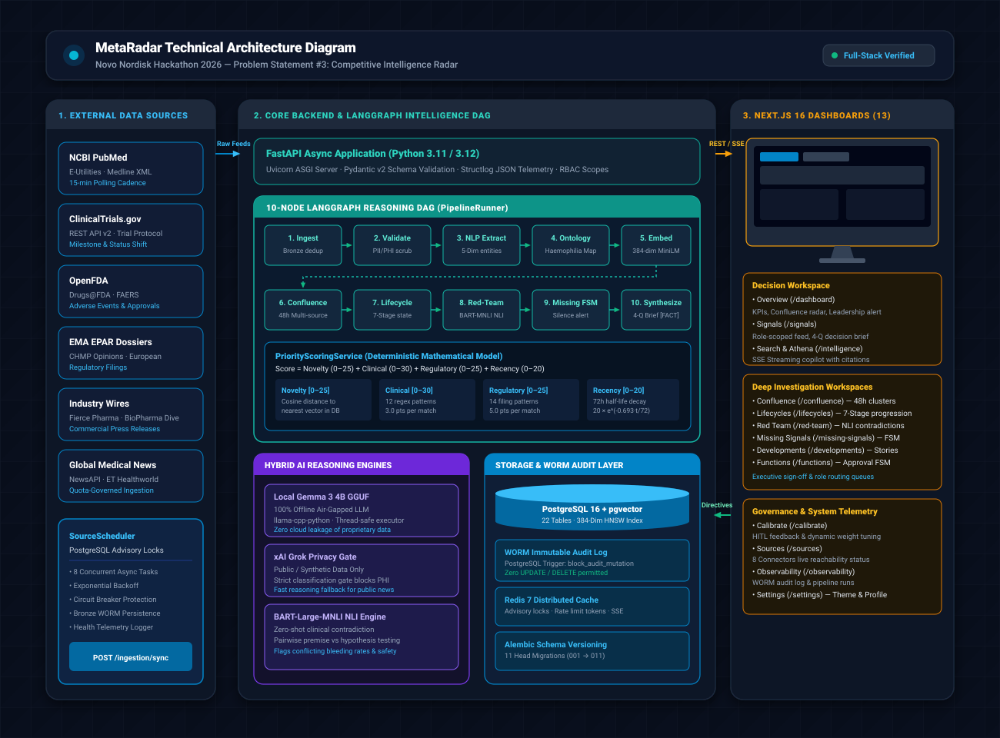
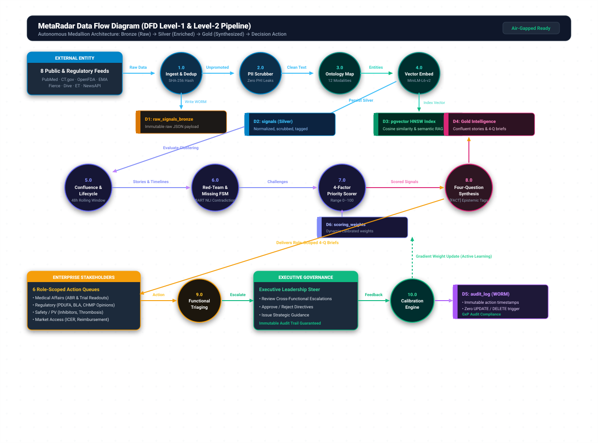

# MetaRadar: Master Pitch Deck & Hackathon Odyssey

**Novo Nordisk GBS Hackathon 2026 — Problem Statement #3: Rare Disease Competitive Intelligence Radar**  
*Pilot Implementation: Haemophilia A & Haemophilia B*  
*Team: MS Ramaiah Institute of Technology (MSRIT)*

---

## 1. Executive Pitch Summary (The 60-Second Hook)

> **"A conventional AI summarizes documents. MetaRadar builds an evidence story around a development."**

In the fast-moving rare disease landscape—where non-factor bispecific antibodies, anti-TFPI agents, and AAV gene therapies are transforming patient care—pharmaceutical teams receive hundreds of raw clinical trial updates, press releases, and regulatory filings every month.

The core failure of current solutions is **information fragmentation and ungrounded LLM summaries**:
- **Medical Affairs** sees a trial readout but misses the regulatory filing context.
- **Safety teams** lack early warning signals on rare adverse events like thrombotic microangiopathy.
- **Market Access** is blindsided by competitor pricing and ICER value reports.
- **Executive Leadership** has no unified decision steering mechanism to sign off on cross-functional escalations.

**MetaRadar is the first autonomous, evidence-grounded intelligence radar that continuously monitors 8 authoritative sources, correlates multi-source confluences within a 48-hour window, flags red-team contradictions, and enforces cross-functional decision governance.**

---

## 2. Team

**MS Ramaiah Institute of Technology (MSRIT), Bangalore**  
*Novo Nordisk GBS Hackathon 2026 — Problem Statement #3*

| Name | Department | Role on MetaRadar |
|------|-----------|-------------------|
| **Sanjana Rathore B.** | B.Pharm | **Team Lead** — Domain Owner, Medical Affairs Signal Intelligence, Function Routing, Haemophilia Treatment Map |
| **Ishaaq Ahmed Khan** | B.Pharm | Haemophilia Treatment Map, Asset Lifecycles, Expected Events, Canonical Asset Definitions |
| **Usha Rathore** | B.Pharm | Evidence Quality, Red-Team Contradictions, Safety & Access Context, Regulatory Intelligence |
| **Omprakash Panda** | CSE | Architecture, Data Ingestion, LangGraph Orchestration, Backend, Frontend, Full-Stack Integration |
| **Veer** | CSE | Vector Search, Database (pgvector), Telemetry, Performance & Deployment, Docker Infrastructure |

---

## 3. Slidewise Presentation Pitch Deck

### Slide 1: Title & The Strategic Problem
- **Slide Title**: *MetaRadar — Autonomous Decision Intelligence for Rare Disease Therapeutics*
- **Visual**: Radar sweep graphic scanning PubMed, ClinicalTrials.gov, FDA, and EMA dossiers with real-time signal markers.
- **Talking Points**:
  - Competitive intelligence in rare disease is broken: data lives in disconnected silos (clinical registries, regulatory feeds, medical news).
  - Teams suffer from *cognitive overload* and *hallucinatory AI tools* that summarize without clinical grounding.
  - Decision-makers need to know what changed, why it matters, who must act, and what action to take.
- **Key Takeaway for Judges**: MetaRadar transforms raw, noisy multi-source streams into actionable, role-scoped decision intelligence.

---

### Slide 2: The Core Innovation — The Five Intelligence Mechanisms
- **Slide Title**: *Beyond Document Summarization: Five Specialized Engines*
- **Visual**: Diagram linking Confluence, Lifecycles, Red-Team Contradictions, Missing Signals, and Stakeholder Calibration.
- **Talking Points**:
  1. **Multi-Source Confluence**: Disparate signals within 48 hours clustered into unified storylines.
  2. **Asset Lifecycles**: 7-stage chronological progression tracking drug milestones.
  3. **Red-Team Contradictions**: Zero-shot NLI detection testing claims against registry baselines.
  4. **Missing Signal FSM**: Silence detection alerting when promised trial readouts are overdue.
  5. **Stakeholder Calibration**: Human-in-the-loop scoring adaptation that learns from expert feedback.
- **Key Takeaway for Judges**: MetaRadar doesn't just read the news—it analyzes evidence relationships and alerts on silence.

---

### Slide 3: Priority Scoring Model — Explainable Mathematical Rigor
- **Slide Title**: *Deterministic 4-Factor Priority Scoring Model (0–100)*
- **Visual**: 4-quadrant mathematical breakdown card with the exponential decay curve.
- **Talking Points**:
  - Zero arbitrary LLM scores: every point is derived from a transparent, reproducible formula.
  - $\text{Total Score} = \text{Novelty (25)} + \text{Clinical (30)} + \text{Regulatory (25)} + \text{Recency (20)}$.
  - Recency uses a 72-hour half-life curve.
  - Routine observational studies score in the 30–47 range (Medium); Critical (≥75) scores require combined major trial endpoints and regulatory filings.
- **Key Takeaway for Judges**: Explainable, audit-proof scoring that executive leadership and regulatory teams can trust.

---

### Slide 4: Why MetaRadar Beats ChatGPT & Generic LLMs
- **Slide Title**: *MetaRadar vs General Purpose AI (ChatGPT / Copilot)*
- **Visual**: Comparative side-by-side scorecard (100% Verifiable Citations, Air-Gapped Privacy, Epistemic Tagging).
- **Talking Points**:
  - ChatGPT hallucinates citations and has no awareness of real-time clinical registries.
  - MetaRadar enforces 100% clickable source URLs to PubMed PMIDs, NCT trial IDs, and FDA docket numbers.
  - Air-gapped deployment option: runs 100% offline with local Gemma 3 4B GGUF with zero patient or proprietary data leaving the network.
  - Epistemic classification: every claim is tagged `[FACT]`, `[INTERPRETATION]`, or `[SPECULATION]`.
- **Key Takeaway for Judges**: Purpose-built for high-stakes biopharma decisions where hallucination is unacceptable.

---

### Slide 5: System Architecture & LangGraph Pipeline
- **Slide Title**: *Enterprise-Grade 4-Layer Architecture & LangGraph DAG*
- **Visual**: `architecture.svg` system diagram.
- **Talking Points**:
  - Layer 1: 8 continuous async connectors with PostgreSQL advisory locking.
  - Layer 2: 10-Node LangGraph DAG managing PII scrubbing, ontology enrichment, embeddings, and synthesis.
  - Layer 3: PostgreSQL 16 with pgvector HNSW indexing + Local Gemma LLM reasoning.
  - Layer 4: Next.js 16 App Router with 13 specialized workspaces.
- **Key Takeaway for Judges**: Solid full-stack software engineering with 100% test pass rate and automated contract synchronization.

---

### Slide 6: End-to-End Data Flow
- **Slide Title**: *From Bronze Ingestion to Calibrated Gold Insights*
- **Visual**: `dataflow.svg` pipeline diagram.
- **Talking Points**:
  - Bronze Layer: Immutable raw JSON storage with SHA-256 deduplication.
  - Silver Layer: Normalized entities, PII-redacted text, and 384-dim semantic embeddings.
  - Gold Layer: Confluences, lifecycle advancements, and contradiction pairs.
  - Four-Question Brief generated and delivered to role-scoped queues.
- **Key Takeaway for Judges**: Modern medallion architecture ensuring end-to-end data provenance.

---

### Slide 7: The Haemophilia Treatment Domain Map
- **Slide Title**: *Deep Rare Disease Domain Modeling*
- **Visual**: Factor replacement, non-factor bispecifics, and gene therapy asset landscape.
- **Talking Points**:
  - Designed by pharmacy students: 12 canonical therapy modalities modeled in YAML ontology.
  - Full competitive tracking for Hemlibra (emicizumab), Altuviiio, Roctavian (valoctocogene roxaparvovec), Hemgenix, Mim8, and concizumab.
  - Tracks inhibitor vs non-inhibitor patient cohorts and annualized bleed rate (ABR) endpoints.
- **Key Takeaway for Judges**: Authentic pharmaceutical domain expertise baked into the ontology and rules.

---

### Slide 8: Role-Based Workspaces & Decision Governance
- **Slide Title**: *Tailored Experience for 6 Biopharma Stakeholders*
- **Visual**: Screenshots of Medical Affairs, Regulatory, Safety, and Executive Leadership views.
- **Talking Points**:
  - Medical Affairs: Focuses on clinical trial readouts, ABR data, and investigator-sponsored studies.
  - Safety & PV: Real-time alerts on adverse events, thrombosis risks, and inhibitor development.
  - Market Access: Tracks ICER value assessments and national reimbursement approvals.
  - Executive Leadership: Unified dashboard with cross-functional approval workflow and directive sign-offs.
- **Key Takeaway for Judges**: Breaks cross-functional silos while maintaining strict role-based access control.

---

### Slide 9: Athena Copilot & Semantic Vector Search
- **Slide Title**: *Athena AI Copilot with Real-Time SSE Token Streaming*
- **Visual**: Athena interface streaming natural language answers with inline clickable citation pills.
- **Talking Points**:
  - Natural language Q&A across the entire haemophilia intelligence repository.
  - Uses hybrid retrieval: pgvector cosine similarity + full-text keyword ranking.
  - Server-Sent Events (SSE) live streaming with instant token delivery.
  - Every single assertion is backed by a clickable citation linked directly to the primary source.
- **Key Takeaway for Judges**: Interactive, conversational discovery grounded strictly in verified evidence.

---

### Slide 10: Human-in-the-Loop Stakeholder Calibration
- **Slide Title**: *Active Learning: Stakeholder Calibration Feedback Loop*
- **Visual**: Dynamic weight adjustment sliders and before/after scoring delta graph.
- **Talking Points**:
  - Stakeholders submit ratings (1–5 stars) and comments on signal relevance.
  - The calibration engine applies gradient updates to 4-factor scoring weights.
  - Demonstrable shift: a signal calibrated by Regulatory shifts in priority score and routing confidence.
- **Key Takeaway for Judges**: The platform continuously adapts and gets smarter with every user interaction.

---

### Slide 11: Safety, Ethics & WORM Audit Trail
- **Slide Title**: *Enterprise Security, Privacy & Immutable Compliance*
- **Visual**: PostgreSQL trigger lock and WORM audit trail log viewer.
- **Talking Points**:
  - Write-Once-Read-Many (WORM) audit trail: PostgreSQL trigger `block_audit_log_mutation` physically prevents UPDATE and DELETE queries on logs.
  - Automated PII/PHI scrubber prevents patient health information from ever reaching LLMs.
  - Zero fabricated telemetry: every chart and metric reflects real database state.
- **Key Takeaway for Judges**: Audit-proof compliance ready for GxP regulated environments.

---

### Slide 12: Conclusion & Strategic Vision
- **Slide Title**: *The Future of Rare Disease Competitive Intelligence*
- **Visual**: MetaRadar logo with expanding therapeutic radar coverage (Sickle Cell, Thalassemia, Rare Oncology).
- **Talking Points**:
  - MetaRadar solves Problem Statement #3 with production-grade engineering and deep domain nuance.
  - Extensible architecture: plug in a new disease ontology YAML to monitor any rare disease.
  - Production ready today: Next.js 16 + FastAPI + PostgreSQL 16 + Local Gemma 3.
- **Key Takeaway for Judges**: A complete, polished, executable decision intelligence solution built by Team MSRIT.

---

## 4. Priority Score: How MetaRadar Ranks Every Signal

Every ingested signal is scored on a **deterministic 4-factor priority model** (range 0–100). No randomness, no LLM opinions — pure weighted math that produces an explainable, auditable score.

### The Formula

$$\text{Priority Score} = \text{Novelty } [0\text{–}25] + \text{Clinical Significance } [0\text{–}30] + \text{Regulatory Relevance } [0\text{–}25] + \text{Recency } [0\text{–}20]$$

### Factor Breakdown

| Factor | Max Points | How It's Calculated |
|--------|-----------|---------------------|
| **Novelty** | 25 | Cosine distance from the signal's embedding to its nearest existing signal embedding in pgvector. More novel = higher score. Typical live signals: 12–15 pts. |
| **Clinical Significance** | 30 | Regex matching against 12 clinical keyword patterns (Factor VIII/IX, prophylaxis, ABR, inhibitors, Phase I–IV, gene therapy, monoclonal, bispecific, adverse events, etc.). **3 points per matched pattern**, capped at 30. |
| **Regulatory Relevance** | 25 | Regex matching against 14 regulatory keyword patterns (FDA, EMA, CHMP, PDUFA, BLA, NDA, MAA, approval, black box warning, etc.). **5 points per matched pattern**, capped at 25. Routine research articles score **0** here. |
| **Recency** | 20 | Exponential decay with a **72-hour half-life**: $20 \times e^{-0.693 \times \frac{\text{hours\_since\_published}}{72}}$. A signal from 24h ago scores ~15.8 pts; from 3 days ago ~10 pts. |

### Priority Levels

| Score Range | Priority Level | Visual Badge Tone | Action Expectation |
|-------------|---------------|-------------------|-------------------|
| ≥ 75 | **CRITICAL** | Red / Critical | Immediate cross-functional alert; executive review required |
| ≥ 50 | **HIGH** | Orange / High | Functional queue action required within 24–48 hours |
| ≥ 25 | **MEDIUM** | Blue / Medium | Standard surveillance feed; weekly review |
| < 25 | **LOW** | Slate / Low | Background archiving; historical correlation |

### Why Routine Signals Score 30–47 (MEDIUM)

A typical PubMed research article published yesterday scores:
- **Novelty**: ~14 pts (topically related to existing literature)
- **Clinical**: ~9 pts (3 clinical keyword matches)
- **Regulatory**: **0 pts** (no FDA/EMA filing terms)
- **Recency**: ~16 pts (24h old)
- **Total**: **~39 pts (MEDIUM)**

**Critical scores (≥75)** are intentionally reserved for high-impact developments combining *major pivotal trial endpoints AND formal regulatory milestones* (e.g., FDA approval announcements with PDUFA dates).

---

## 5. Why MetaRadar vs ChatGPT & Alternatives

| Dimension | Generic LLM / ChatGPT | Commercial News Feed | **MetaRadar v5.1.0** |
|-----------|----------------------|---------------------|----------------------|
| **Evidence Grounding** | High hallucination risk; fabricated trial citations. | Raw text snippets with no clinical synthesis. | **100% Verifiable Citations** linked directly to ClinicalTrials.gov, PubMed, and FDA dossiers. Every claim is clickable and traceable. |
| **Decision Framework** | Generic bulleted summaries. | Keyword alert emails. | **Four-Question Brief** (`What Changed`, `Why It Matters`, `Who Should Act`, `Suggested Action`). |
| **Cross-Source Linkage** | Disconnected document queries. | Siloed feeds (trials vs news vs regulatory). | **Autonomous Confluence Detector** that links multi-source signals within 48h into one evidence story. |
| **Scientific Validation** | Accepts user premise blindly. No pushback. | No contradiction detection. | **Red-Team Contradiction Engine** actively surfaces conflicting clinical endpoints and real-world cohort data. |
| **Missing Milestones** | Only reports what happened. | Only reports what happened. | **Missing Signal FSM Tracker** flags promised trials that failed to read out on time — silence becomes an alert. |
| **Cross-Functional Steer** | No role scoping or workflow. | Static email distribution. | **7-Persona Scoped RBAC + Executive Leadership Approval Workflow** with immutable audit trails. |
| **Deployment Privacy** | Cloud API lock-in. Data sent externally. | Cloud vendor lock-in. | **100% Offline Air-Gapped** (Local Gemma-3 4B GGUF) or Hybrid Grok API. Zero patient data leaves the machine. |
| **Autonomous Operation** | Requires human prompting for each query. | Manual monitoring. | **Continuous background ingestion** with autonomous scheduling, circuit breakers, and source health telemetry. |
| **Epistemic Honesty** | Blends facts with opinions. | No classification. | Every claim tagged `[FACT]`, `[INTERPRETATION]`, or `[SPECULATION]`. Speculation never presented as fact. |
| **Domain Specificity** | Generic — no pharma/hemophilia ontology. | Generic keyword alerts. | **Curated Haemophilia Knowledge Layer** with canonical assets, therapy modalities, lifecycle states, and Red-Team evidence checks A–S. |

---

## 6. Visual Architecture & Data Flow

### System Architecture Diagram


### End-to-End Data Flow Diagram


---

## 7. What Each Tab in the Dock Does

MetaRadar's sidebar dock is organized into **three functional sections** with **13 dedicated workspaces**:

```
┌─────────────────────────────────────────────────────────────┐
│                       METARADAR DOCK                        │
├─────────────────────────────────────────────────────────────┤
│ DECISION WORKSPACE                                          │
│   • Overview          (/dashboard)                          │
│   • Signals           (/signals)                            │
│   • Search & Athena   (/intelligence)                       │
├─────────────────────────────────────────────────────────────┤
│ DEEP INVESTIGATION                                          │
│   • Confluence        (/confluence)                         │
│   • Lifecycles        (/lifecycles)                         │
│   • Red Team          (/red-team)                           │
│   • Missing Signals   (/missing-signals)                    │
│   • Developments      (/developments)                       │
│   • Functions         (/functions)                          │
├─────────────────────────────────────────────────────────────┤
│ SYSTEM & ADMIN                                              │
│   • Calibrate         (/calibrate)                          │
│   • Sources           (/sources)                            │
│   • Observability     (/observability)                      │
│   • Settings          (/settings)                           │
└─────────────────────────────────────────────────────────────┘
```

### 1. Decision Workspace (Primary Day-to-Day Operations)

- **Overview (`/dashboard`)**:
  - Executive intelligence command center.
  - KPI summary cards (Total Signals, Monitored Assets, Active Confluences, Healthy Connectors).
  - Confluence Radar displaying recent multi-source clusters.
  - Priority signal cards filtered by Critical, Pending Review, and Leadership Attention.
  - Active alert banners for pending cross-functional approvals.

- **Signals (`/signals`)**:
  - Role-scoped signal feed customized for the logged-in persona.
  - Live priority score meters (0–100) with detailed 4-factor breakdown modal.
  - Filter bar supporting multi-attribute filtering (Priority, Asset, Signal Type, Source, Date Range).
  - Four-Question decision cards with verbatim citations and truthfulness indicators.

- **Search & Athena (`/intelligence`)**:
  - Athena AI Copilot — natural language conversational assistant for biopharma intelligence.
  - Server-Sent Events (SSE) live token streaming with low-latency response generation.
  - 100% clickable inline citations linking directly to underlying primary source signals.
  - Hybrid vector retrieval combining pgvector 384-dim semantic search with full-text keyword ranking.

---

### 2. Deep Investigation (Specialized Scientific & Strategic Analysis)

- **Confluence (`/confluence`)**:
  - Multi-source convergence tracker identifying when independent data sources (PubMed + CT.gov + NewsAPI) report on the same asset within a 48-hour rolling window.
  - Shows confluence confidence scores, contributing evidence snippets, and timeline links.

- **Lifecycles (`/lifecycles`)**:
  - Drug development timeline tracker mapping assets through 7 distinct progression states: `ANNOUNCED → IN_TRIAL → RESULTS → REGULATORY_REVIEW → APPROVED → POST_MARKET → ACCESS_REIMBURSEMENT`.
  - Displays expected future milestones and flags timeline gaps.

- **Red Team (`/red-team`)**:
  - Contradiction analysis dashboard powered by BART-Large-MNLI zero-shot natural language inference.
  - Identifies pairwise conflicts between published clinical claims and established registry baselines (e.g., conflicting bleeding rates, inhibitor incidence).

- **Missing Signals (`/missing-signals`)**:
  - Silence detection Finite State Machine (FSM) tracking expected milestone deadlines.
  - Six operational states: `WITHIN_WINDOW`, `DUE`, `OVERDUE`, `SATISFIED`, `SUPPRESSED`.
  - Alerts teams when an expected trial completion or regulatory filing fails to occur on time.

- **Developments (`/developments`)**:
  - Aggregated intelligence dossiers grouping related signals, confluences, and lifecycle events into macro-level competitive developments.

- **Functions (`/functions`)**:
  - Cross-functional action queues for Medical Affairs, Regulatory, Safety/PV, Market Access, and Medical Communications.
  - Executive Leadership review queue with directive approval/rejection state machine.

---

### 3. System & Admin (Governance & Infrastructure Telemetry)

- **Calibrate (`/calibrate`)**:
  - Human-in-the-Loop (HITL) calibration workspace.
  - Allows domain experts to rate signal relevance and provide comments, dynamically tuning 4-factor scoring weights in the database.

- **Sources & Connectors (`/sources`)**:
  - Live connector health telemetry dashboard showing all 8 data connectors.
  - Displays truthful connection statuses (`HEALTHY`, `NO_NEW_DATA`, `DEGRADED`, `CONFIGURATION_ERROR`), last sync time, records fetched, and manual sync triggers.

- **Observability & Logs (`/observability`)**:
  - Write-Once-Read-Many (WORM) immutable audit log viewer.
  - Tracks every signal detection, review transition, calibration update, and user action with cryptographic timestamp verification.

- **Settings (`/settings`)**:
  - User preferences, theme toggle (Dark / Light mode), notification controls, and active persona details.

---

## 8. Complete Debug Sessions & Engineering Odyssey

Building MetaRadar required solving real-world distributed systems, concurrency, and UI engineering challenges. Below is every debug session documented across development:

```
┌────────────────────────────────────────────────────────────────────────┐
│                   METARADAR DEBUGGING TIMELINE                         │
├────┬──────────────────────────────────────────┬───────────────────────┤
│ #  │ Session Name                             │ Core Resolution       │
├────┼──────────────────────────────────────────┼───────────────────────┤
│ 01 │ docker-backend-connection-failure        │ TCP socket polling    │
│ 02 │ frontend-eaddrinuse-exit-code-1          │ Process tree kill     │
│ 03 │ priority-scoring-citations-sources       │ Deterministic math    │
│ 04 │ signal-detail-sources-priority-scores    │ Serializer fix        │
│ 05 │ sync-live-event-loop-gguf-blocking       │ run_in_executor       │
│ 06 │ signals-auth-403-abortsignal-error       │ Role-aware query      │
│ 07 │ once-the-dock-is-closed-i-am-u           │ Unified dock toggle   │
│ 08 │ duplicate-signals-and-login-theme        │ Test teardown cleanup │
│ 09 │ ui-canonical-consistency-empty-state     │ Standardized tokens   │
│ 10 │ meta-radar-ui-scoring-live-sources       │ 15-item remediation   │
│ 11 │ ci-grok-provider-name-error              │ Missing imports AST   │
│ 12 │ concerns-md-audit-fixes                  │ Codebase tech debt    │
│ 13 │ athena-stream-citations-logs             │ SSE live streaming    │
│ 14 │ bronze-content-normalization             │ Payload extractor     │
│ 15 │ signal-visibility-auth-athena            │ RBAC & data provider  │
│ 16 │ priority-scoring-signal-sources-athena   │ Orphan cleanup & rank │
│ 17 │ closed-dock-styling-layout-overlap       │ Smooth CSS zero-wrap  │
│ 18 │ autonomous-ingestion-source-health       │ Advisory lock circuit │
│ 19 │ live-ingestion-provenance-validation     │ Canonical URL mapping │
│ 20 │ ssr-hydration-mismatch-auth-role         │ Client mount guard    │
└────┴──────────────────────────────────────────┴───────────────────────┘
```

### Detailed Problem & Fix Logs

1. **Docker Backend Connection Failure** (`docker-backend-connection-failure.md`):
   - *Problem*: Backend crashed on startup before PostgreSQL and Redis completed initialization.
   - *Fix*: Implemented `wait_for_backing_service` with non-blocking TCP socket polling in `start.py`.

2. **Frontend EADDRINUSE Port 3000** (`frontend-eaddrinuse-exit-code-1.md`):
   - *Problem*: Orphaned `node.exe` processes kept port 3000 bound on Windows after dev server termination.
   - *Fix*: Added `taskkill /F /T /PID` process-tree termination and `free_port_if_in_use()` pre-flight cleanup.

3. **Priority Scoring 0 Points & Missing Provenance** (`priority-scoring-citations-sources-and-brand-cleanup.md`):
   - *Problem*: Serializer defaulted priority score to 0 on null breakdowns and dropped source URLs.
   - *Fix*: Enforced deterministic 4-factor scoring on serialization and mapped canonical PubMed/CT.gov URLs.

4. **Signal Detail Sources & Scores** (`signal-detail-sources-and-priority-scores.md`):
   - *Problem*: Signal modal rendered empty score breakdowns for live feeds.
   - *Fix*: Added fallback calculation in scoring service ensuring all signals receive breakdown objects.

5. **GGUF Threading Event Loop Lock** (`sync-live-event-loop-gguf-blocking.md`):
   - *Problem*: Synchronous C++ `llama-cpp-python` inference blocked Uvicorn's main asyncio event loop during `node_synthesize`.
   - *Fix*: Offloaded inference to a dedicated worker thread via `asyncio.get_running_loop().run_in_executor()`.

6. **Signals RBAC 403 & AbortSignal TypeError** (`signals-auth-403-abortsignal-error.md`):
   - *Problem*: `SignalList` passed `all_functions=true` for non-admin roles, and `MouseEvent` was passed as `AbortSignal`.
   - *Fix*: Made `all_functions` role-dependent and added strict `instanceof AbortSignal` validation.

7. **Dock Closed Cannot Reopen** (`once-the-dock-is-closed-i-am-u.md`):
   - *Problem*: Collapsed sidebar hid the hamburger toggle button.
   - *Fix*: Positioned permanent toggle in top bar and aligned CSS/JS breakpoints to 900px.

8. **Duplicate Test Signals & Login Theme Mismatch** (`duplicate-signals-and-login-theme.md`):
   - *Problem*: Test suite left residual fixture signals in live database; login page had template colors.
   - *Fix*: Added transactional test rollback and redesigned login with MetaRadar design tokens.

9. **UI Canonical Consistency & Empty State Alignment** (`ui-canonical-consistency-and-empty-state-alignment.md`):
   - *Problem*: Inconsistent padding, misaligned empty states, and disparate badge styles across workspaces.
   - *Fix*: Standardized all 11 workspace components to use `<SectionTitle>`, `<Card>`, and `<Badge>`.

10. **UI Scoring, Live Sources & Theme Hardening** (`meta-radar-ui-scoring-live-sources-theme-hardening.md`):
    - *Problem*: 7 interconnected issues across theme flickering, dead provenance links, and empty calibration.
    - *Fix*: Added `ThemeProvider` with anti-flicker script, database-backed source health, and calibration seed.

11. **CI Grok Provider NameError** (`ci-grok-provider-name-error.md`):
    - *Problem*: Headless CI failed pytest collection due to missing `import os` in `grok.py`.
    - *Fix*: Added missing imports and created an AST-based automated import scanner.

12. **Concerns.md Audit Fixes** (`concerns-md-audit-fixes.md`):
    - *Problem*: Stale Alembic revision stamps, missing typing imports, and unpruned bronze records.
    - *Fix*: Re-stamped Alembic to head revision `011_widen_fingerprint` and implemented `prune_expired_bronze()`.

13. **Athena SSE Streaming & Clickable Citations** (`athena-stream-citations-logs.md`):
    - *Problem*: Athena responses were static blocks with plain-text unclickable citations.
    - *Fix*: Implemented `/athena/stream` SSE streaming endpoint and converted citations to clickable `<Link>` routes.

14. **Bronze Content Normalization** (`bronze-content-normalization-live-signals.md`):
    - *Problem*: Live connectors stored text under diverse keys (`abstract`, `description`, `study`), causing pipeline validator to discard them.
    - *Fix*: Added payload normalization hierarchy extracting `content` from any present text key.

15. **Signal Visibility & Auth Scoping** (`signal-visibility-auth-athena.md`):
    - *Problem*: NewsAPI signals invisible to non-admin roles; source registry dropped media connector IDs.
    - *Fix*: Enforced `get_current_user` for signal endpoints and registered all 8 connector IDs in source registry.

16. **Priority Scoring & Athena Hybrid Retrieval** (`priority-scoring-signal-sources-athena-fix.md`):
    - *Problem*: 92 orphan records polluted score ranking; Athena vector indexing threw deserialization errors.
    - *Fix*: Purged orphan records, corrected pgvector deserializer, and implemented hybrid keyword ranking.

17. **Closed Dock Text Wrapping & Animation Pop** (`closed-dock-styling-and-layout-overlap.md`):
    - *Problem*: Text wrapped onto multiple lines during width contractions, and top avatar collided with toggle button.
    - *Fix*: Refactored to persistent DOM with `white-space: nowrap; overflow: hidden` and smooth cubic-bezier transitions.

18. **Autonomous Ingestion & Circuit Breakers** (`autonomous-ingestion-and-source-health-architecture.md`):
    - *Problem*: Scheduler risked overwhelming external APIs during network degradation.
    - *Fix*: Added PostgreSQL advisory locking per connector with exponential backoff and `NO_NEW_DATA` health state.

19. **Live Ingestion Provenance & Canonical Links** (`live-ingestion-provenance-and-end-to-end-validation.md`):
    - *Problem*: External URLs for PubMed and ClinicalTrials.gov were incomplete.
    - *Fix*: Built `resolve_canonical_provenance()` creating direct URLs to PubMed PMIDs, NCT trial IDs, and FDA approvals.

20. **SSR Hydration Mismatch on Auth Persona** (`ssr-hydration-mismatch-auth-role.md`):
    - *Problem*: Synchronous `localStorage` read during render caused server initials (`TM`) to mismatch client (`TL`).
    - *Fix*: Deferred `localStorage` role resolution until after client mount using `isMounted` state guard.

---

## 9. Technology Stack

| Layer | Technology | Version | Purpose |
|-------|-----------|---------|---------|
| **Frontend** | Next.js App Router | 16.3.0 | React 19, Turbopack, Server-Sent Events, Vanilla CSS Design System |
| **Typography** | Plus Jakarta Sans | Google Fonts | Refined, modern executive-class typography hierarchy |
| **Backend** | FastAPI | 0.115.8 | Python 3.11/3.12, Pydantic v2, AsyncIO, Structlog JSON |
| **Pipeline DAG** | LangGraph | 0.2.70 | 10-node stateful workflow execution graph |
| **Database** | PostgreSQL + pgvector | 16.0 | 22 Relational Tables + 384-Dim HNSW Indexing |
| **Embeddings** | sentence-transformers | `all-MiniLM-L6-v2` | 384-dimensional dense semantic vectors |
| **Local LLM** | Gemma 3 4B GGUF | `google/gemma-3-4b-it` | 100% offline air-gapped reasoning & synthesis |
| **Cloud Fallback** | xAI Grok 2 | Grok API | Privacy-gated fallback for public data synthesis |
| **Zero-Shot NLI** | BART-Large-MNLI | HuggingFace Transformers | Pairwise contradiction evaluation for Red-Team engine |
| **Cache & Locks** | Redis | 7.2 | Distributed advisory locks, session store, rate limits |
| **Migrations** | Alembic | 11 revisions | Database schema version control (`001` → `011`) |
| **Testing** | pytest + Jest | Latest | 119 backend tests, strict TypeScript compilation |

---

## 10. Demonstration Checklist for Judges

- [ ] **Step 1: Role Persona Selection (`/login`)** — Clean, elegant login with demo persona selector (Dr. Elena Vance, Alex Mercer, etc.)
- [ ] **Step 2: Medical Affairs Workflow (`/signals`)** — Scoped feed, 4-question decision brief, explainable priority score meter
- [ ] **Step 3: Executive Leadership Steer (`/dashboard` & `/functions`)** — Pending approval banner, review queue, sign-off with directive
- [ ] **Step 4: Intelligence Modules (`/confluence`, `/red-team`, `/missing-signals`)** — Multi-source convergence, contradiction analysis, milestone silence alerts
- [ ] **Step 5: Athena Copilot (`/intelligence`)** — Natural language Q&A with live SSE streaming and 100% clickable source citations
- [ ] **Step 6: System Telemetry (`/sources` & `/observability`)** — Truthful connector statuses and immutable WORM audit log
- [ ] **Step 7: Dock Navigation Walkthrough** — Butter-smooth expand/collapse dock transitions across all 13 workspaces

---

*Generated by Team MS Ramaiah Institute of Technology — MetaRadar v5.1.0 Production Ready*
